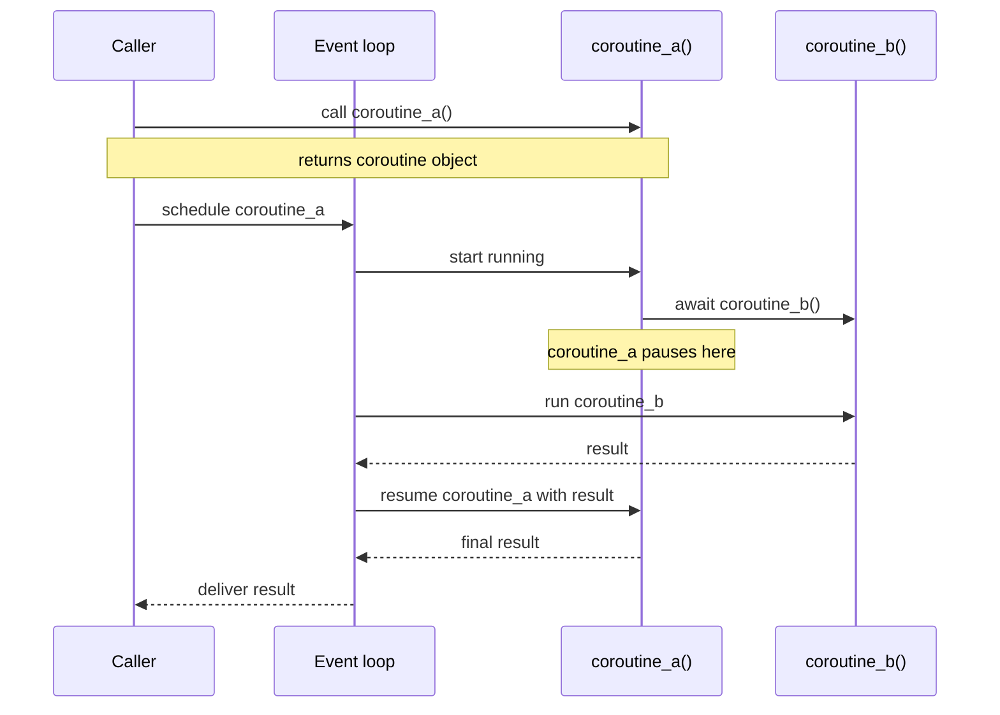
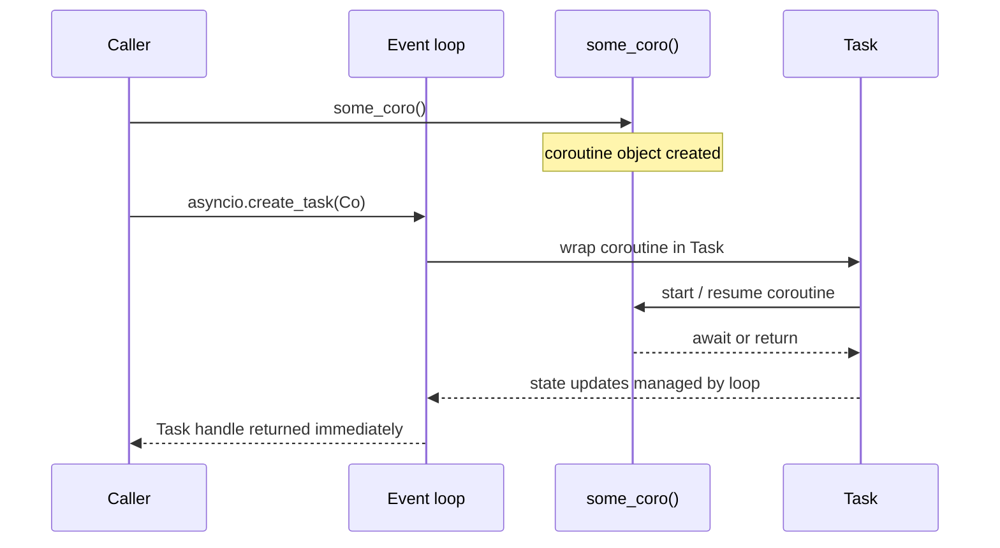
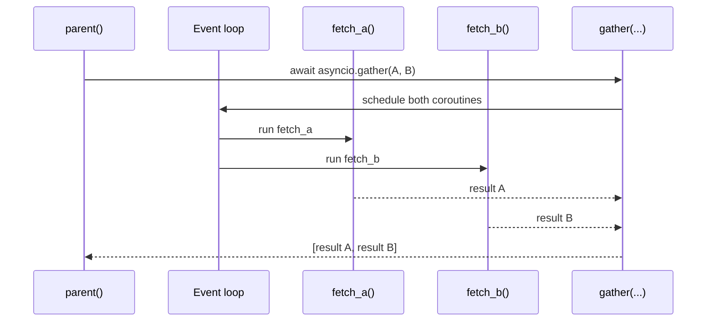
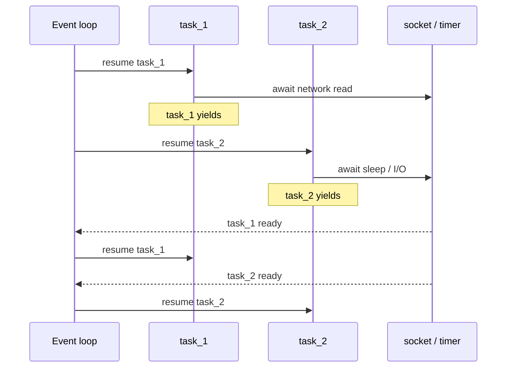
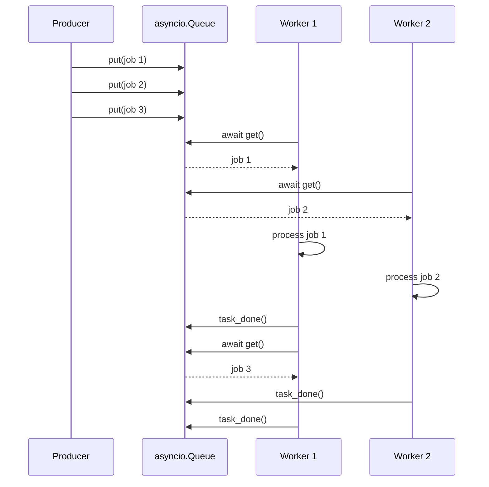
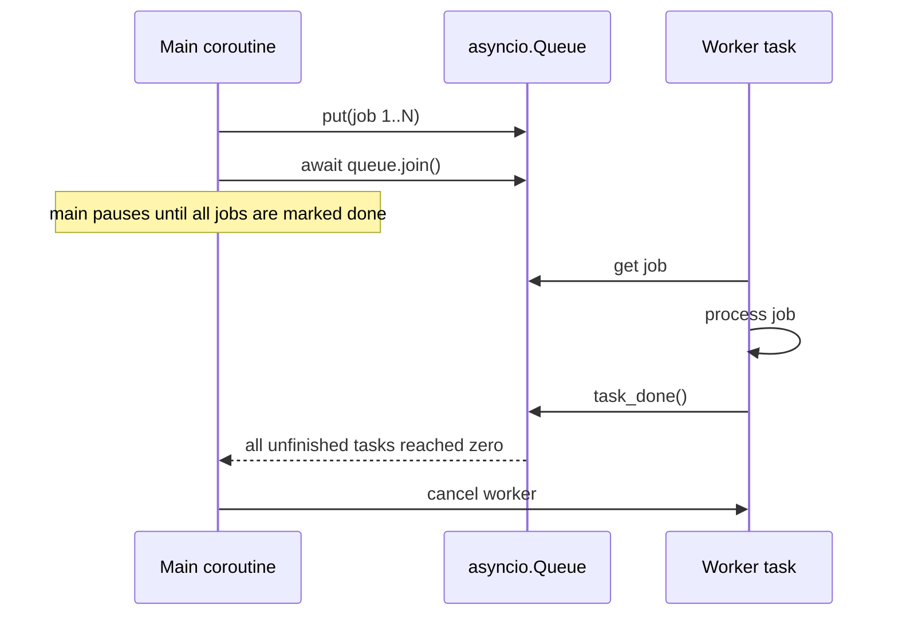
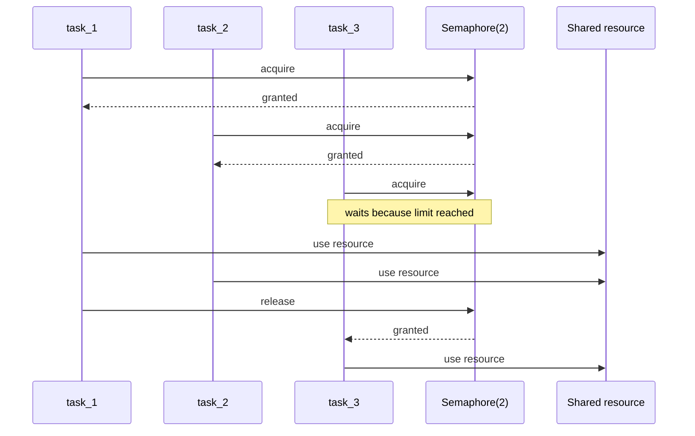
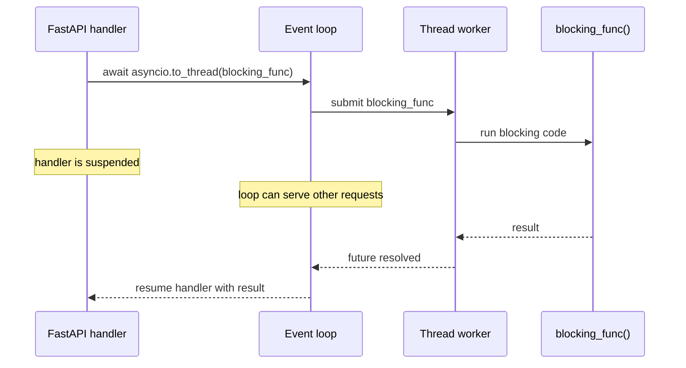
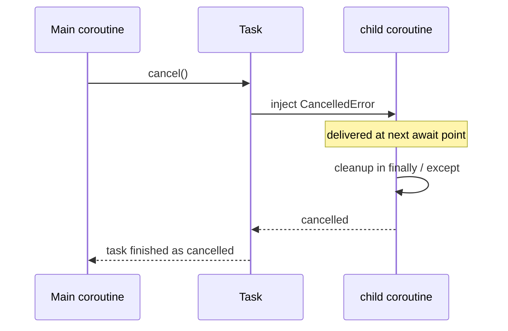

# Asyncio Sequence Diagrams

Date: 2026-04-10

Goal: build an intuition for how `async` / `await`, coroutines, tasks, queues, workers, and related asyncio primitives behave at runtime.


```
CPU
 └ thread
    └ asyncio event loop
        ├ coroutine
        ├ coroutine
        └ coroutine
```


## 1. `async def` and `await`

Key idea:

- `async def` defines a coroutine function.
- Calling it creates a coroutine object.
- The coroutine does not make progress until the event loop runs it.
- `await` suspends the current coroutine and lets the event loop run something else.




## 2. Coroutine object versus Task

Key idea:

- A coroutine object is just a resumable computation.
- A `Task` is the event loop actively managing that coroutine.
- `asyncio.create_task(...)` turns a coroutine into scheduled concurrent work.




## 3. Awaiting directly versus creating a Task

Key idea:

- `await coro()` means "pause here until this finishes."
- `create_task(coro())` means "let this run concurrently while I keep going."

```mermaid
sequenceDiagram
    participant P as parent()
    participant L as Event loop
    participant C1 as child()
    participant T as Task(child)

    rect rgb(0, 0, 0)
        P->>C1: await child()
        Note over P: parent pauses immediately
        L->>C1: run child
        C1-->>P: result
    end

    rect rgb(0, 0, 0)
        P->>L: create_task(child())
        L->>T: schedule Task
        L-->>P: Task returned immediately
        Note over P: parent keeps running
        T->>T: child executes concurrently
    end
```




## 4. `asyncio.gather(...)` fan-out and fan-in

Key idea:

- `gather(...)` schedules multiple awaitables together.
- The caller suspends once, then resumes after all results are ready.




## 5. Event loop interleaving at `await` points

Key idea:

- Async concurrency is cooperative.
- Switching happens when a coroutine awaits something that is not ready yet.
- If code never awaits, it can monopolize the loop.




## 6. Queue with producer and workers

Key idea:

- `asyncio.Queue` decouples producers from consumers.
- Producers `put(...)` work items into the queue.
- Worker tasks `get()` items, process them, then call `task_done()`.




## 7. Waiting for a queue to drain with `queue.join()`

Key idea:

- `queue.join()` waits until every queued item has a matching `task_done()`.
- This is how a coordinator can wait for all enqueued work to finish.




## 8. Semaphore limiting concurrency

Key idea:

- A semaphore is a gate that limits how many coroutines may enter a critical section at once.
- This is useful for DB pools, rate-limited APIs, or bounded downstream capacity.




## 9. Offloading blocking work with `asyncio.to_thread(...)`

Key idea:

- The event loop stays responsive because the blocking function runs in a worker thread.
- This helps protect unrelated async work from being stuck behind blocking code.




## 10. Cancellation flow

Key idea:

- Cancelling a task raises `CancelledError` inside that coroutine at the next await point.
- Well-behaved coroutines clean up and then re-raise or exit.




## Reading Guide

Use these diagrams as a mental model:

- If a coroutine is `await`ing, the loop may run other work.
- If code is CPU-bound and never yields, it blocks progress on that loop thread.
- Tasks are the event loop's units of scheduled coroutine execution.
- Queues and semaphores are coordination tools, not magic performance tools.
- Worker patterns help organize concurrency, but they still depend on where blocking happens.

