# Experiment Record: `/sleep/blocking` vs `/sleep/async`

Date: 2026-04-10

Goal: manually observe whether one long-running request interferes with an unrelated `/health` request when the handler uses `time.sleep(...)` versus `await asyncio.sleep(...)`.

## Setup

Run the app locally with a single Uvicorn worker:

```bash
uv run uvicorn app.main:app --host 0.0.0.0 --port 8000
```

Use two terminals:
- Terminal 1: start the long-running request
- Terminal 2: send `/health` while Terminal 1 is still in progress

## Observation 1: async sleep does not block unrelated requests

Terminal 1:

```bash
time curl "http://localhost:8000/sleep/async?seconds=5"
{"status":"ok"}
________________________________________________________
Executed in    5.03 secs      fish           external
   usr time    4.81 millis    0.35 millis    4.46 millis
   sys time    8.87 millis    1.96 millis    6.91 millis
```

Interpretation:
- The `/sleep/async` request took about 5 seconds, as expected.
- Because it uses `await asyncio.sleep(...)`, the event loop can continue serving other requests during that wait.

## Observation 2: `/health` stays fast while `/sleep/async` is in flight

Terminal 2:

```bash
time curl "http://localhost:8000/health"
{"status":"ok"}
________________________________________________________
Executed in   15.09 millis    fish           external
   usr time    4.14 millis  218.00 micros    3.93 millis
   sys time    5.68 millis  954.00 micros    4.72 millis
```

Interpretation:
- `/health` completed in about 15 ms even while the 5-second async sleep request was running.
- This is the expected behavior for cooperative async waiting.

## Observation 3: blocking sleep delays unrelated requests

Terminal 1:

```bash
curl "http://localhost:8000/sleep/blocking?seconds=5"
{"status":"ok"}
```

Terminal 2, issued while the blocking request was still running:

```bash
time curl "http://localhost:8000/health"
{"status":"ok"}
________________________________________________________
Executed in    3.71 secs      fish           external
   usr time    4.76 millis    0.34 millis    4.42 millis
   sys time    7.30 millis    1.37 millis    5.93 millis
```

Interpretation:
- `/health` took about 3.71 seconds instead of returning immediately.
- That delay indicates the worker could not make progress on `/health` while `/sleep/blocking` was inside `time.sleep(...)`.
- This demonstrates cross-request interference caused by blocking the event loop in a request handler.

## Conclusion

Result:
- `/sleep/async` holds the request open for 5 seconds without significantly harming `/health`.
- `/sleep/blocking` causes unrelated requests like `/health` to wait behind it.

Main takeaway:
- In an `async def` FastAPI endpoint, `await asyncio.sleep(...)` yields control back to the event loop.
- `time.sleep(...)` blocks the event loop thread, so unrelated requests handled by the same worker are delayed.


## Sequence Diagram

```mermaid
sequenceDiagram
    participant T1 as Terminal 1
    participant T2 as Terminal 2
    participant U as Uvicorn worker
    participant A as FastAPI app

    rect rgb(0, 0, 0)
        T1->>U: GET /sleep/async?seconds=5
        U->>A: dispatch request
        A->>A: await asyncio.sleep(5)
        Note over A,U: handler yields control to the event loop
        T2->>U: GET /health
        U->>A: dispatch /health
        A-->>U: 200 OK quickly
        U-->>T2: {"status":"ok"} in about 15 ms
        A-->>U: async sleep completes
        U-->>T1: {"status":"ok"} in about 5.03 s
    end

    rect rgb(0, 0, 0)
        T1->>U: GET /sleep/blocking?seconds=5
        U->>A: dispatch request
        A->>A: time.sleep(5)
        Note over A,U: worker thread is blocked
        T2->>U: GET /health
        Note over T2,U: request waits behind the blocking handler
        A-->>U: blocking sleep completes
        U-->>T1: {"status":"ok"} in about 5 s
        U->>A: dispatch /health
        A-->>U: 200 OK
        U-->>T2: {"status":"ok"} after about 3.71 s wait
    end
```



## Suggested next run

Repeat the same manual experiment with:
- multiple overlapping `/sleep/blocking` requests
- mixed `/sleep/blocking` and `/health` traffic in Locust
- one worker versus multiple workers
