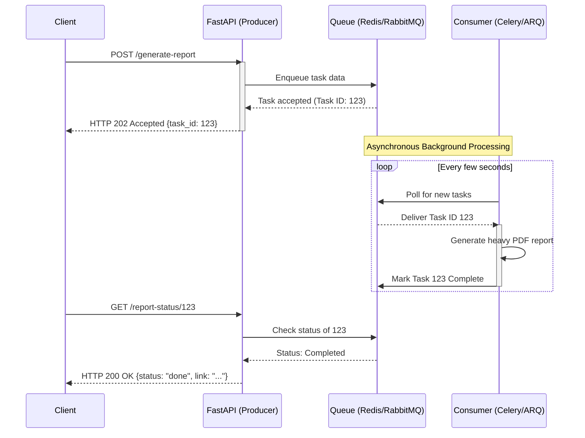

```mermaid
sequenceDiagram
    participant Client
    participant API as FastAPI (Producer)
    participant Broker as Queue (Redis/RabbitMQ)
    participant Worker as Consumer (Celery/ARQ)

    Client->>API: POST /generate-report
    activate API
    API->>Broker: Enqueue task data
    Broker-->>API: Task accepted (Task ID: 123)
    API-->>Client: HTTP 202 Accepted {task_id: 123}
    deactivate API

    Note over Broker,Worker: Asynchronous Background Processing
    loop Every few seconds
        Worker->>Broker: Poll for new tasks
        Broker-->>Worker: Deliver Task ID 123
        activate Worker
        Worker->>Worker: Generate heavy PDF report
        Worker->>Broker: Mark Task 123 Complete
        deactivate Worker
    end

    Client->>API: GET /report-status/123
    API->>Broker: Check status of 123
    Broker-->>API: Status: Completed
    API-->>Client: HTTP 200 OK {status: "done", link: "..."}
```