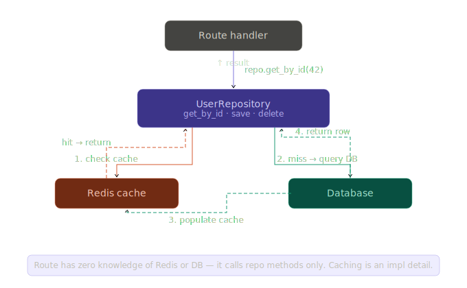

# Lifetime Vs Dependency Injection

This page cites the two architecture diagrams in `docs/assets` and keeps the image paths relative to this document so standard Markdown renderers can resolve the SVGs correctly.

## Citation 1: Redis Lifespan vs Dependency Injection

This sequence diagram shows the split between application lifespan and request-time dependency injection: startup creates the Redis pool once, each request reads that shared pool from `app.state`, and shutdown closes it once.

_Redis pool lifecycle across FastAPI startup, request handling, and shutdown._

## Citation 2: Repository Pattern with Cache-Aside

This diagram shows the repository pattern keeping caching as an implementation detail: the route handler calls repository methods, the repository checks Redis first, falls back to the database on a cache miss, and then repopulates the cache.

_Repository boundary where cache lookups and database fallbacks stay out of the route layer._
