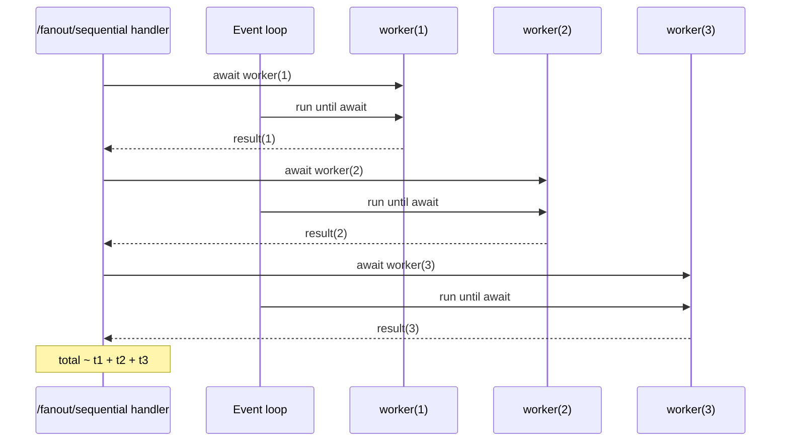
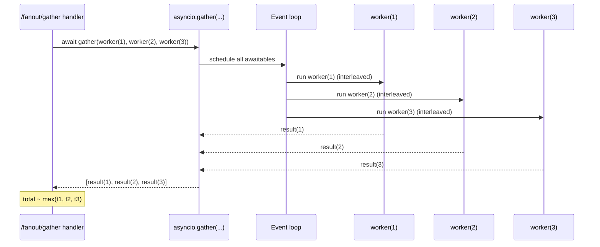

## Experiment Record: `/fanout/sequential` vs `/fanout/gather`

Date: 2026-04-10

Goal: compare **sequential fan-out** (await each subtask one-by-one) against **concurrent fan-out** (schedule all subtasks, then await them together) and see the difference in end-to-end latency and event-loop scheduling.

## Setup

Run the app locally with one Uvicorn worker:

```bash
uv run uvicorn app.main:app --host 0.0.0.0 --port 8000
```

Both endpoints use the same worker behavior from [app/main.py](/Users/yao/projects/fastapi-load-testing/app/main.py):
- `num_tasks=15`
- `delay_ms=300`
- Each worker does `await asyncio.sleep(delay_ms / 1000)`

That means the ideal expectation is:
- Sequential total time: about `15 * 300 ms = 4500 ms`
- Gather total time: about `300 ms` plus scheduling overhead

## Observation 1: sequential fan-out accumulates per-task delay

```bash
time curl "http://localhost:8000/fanout/sequential"
{"status":"ok","num_tasks":15,"delay_ms":300,"total_duration_ms":4530.32,"results":[{"task_id":1,"duration_ms":304.13},{"task_id":2,"duration_ms":300.33},{"task_id":3,"duration_ms":300.34},{"task_id":4,"duration_ms":299.98},{"task_id":5,"duration_ms":301.18},{"task_id":6,"duration_ms":302.23},{"task_id":7,"duration_ms":301.51},{"task_id":8,"duration_ms":300.97},{"task_id":9,"duration_ms":304.65},{"task_id":10,"duration_ms":303.58},{"task_id":11,"duration_ms":301.94},{"task_id":12,"duration_ms":301.53},{"task_id":13,"duration_ms":301.88},{"task_id":14,"duration_ms":302.26},{"task_id":15,"duration_ms":302.97}]}
________________________________________________________
Executed in    4.57 secs      fish           external
   usr time    5.11 millis    0.33 millis    4.78 millis
   sys time   10.47 millis    1.11 millis    9.36 millis
```

Interpretation:
- The server-reported total was `4530.32 ms`, which is very close to `15 * 300 ms`.
- Each worker took about `300 ms`, but because the handler awaited them one-by-one, request latency grew roughly as the sum of all worker delays.
- This matches the expected behavior of sequential fan-out.

## Observation 2: `asyncio.gather(...)` collapses total latency to one wait window

```bash
time curl "http://localhost:8000/fanout/gather"
{"status":"ok","num_tasks":15,"delay_ms":300,"total_duration_ms":302.69,"results":[{"task_id":1,"duration_ms":301.52},{"task_id":2,"duration_ms":301.5},{"task_id":3,"duration_ms":301.5},{"task_id":4,"duration_ms":301.5},{"task_id":5,"duration_ms":301.5},{"task_id":6,"duration_ms":301.51},{"task_id":7,"duration_ms":301.54},{"task_id":8,"duration_ms":301.52},{"task_id":9,"duration_ms":301.52},{"task_id":10,"duration_ms":301.52},{"task_id":11,"duration_ms":301.53},{"task_id":12,"duration_ms":301.5},{"task_id":13,"duration_ms":301.52},{"task_id":14,"duration_ms":301.52},{"task_id":15,"duration_ms":301.52}]}
________________________________________________________
Executed in  342.21 millis    fish           external
   usr time    5.57 millis    0.32 millis    5.25 millis
   sys time   11.95 millis    1.24 millis   10.71 millis
```

Interpretation:
- The server-reported total was `302.69 ms`, essentially one worker-delay window.
- Individual worker durations were still about `301-302 ms`, but they overlapped in the same request.
- This is the expected outcome when the subtasks mostly wait cooperatively and are joined with `asyncio.gather(...)`.

## Comparison

Result:
- `/fanout/sequential`: `4530.32 ms`
- `/fanout/gather`: `302.69 ms`

Observed effect:
- `gather` reduced end-to-end latency by about `93.3%`.
- Sequential fan-out was about `15x` slower than `gather` for this configuration.

Main takeaway:
- For I/O-like subtasks that yield with `await`, `asyncio.gather(...)` changes total request time from roughly the sum of waits to roughly the maximum wait.
- `async def` alone is not the important part here; the win comes from scheduling all awaitable subtasks concurrently instead of awaiting each one before starting the next.


## Sequence diagram: fan-out sequential

Key idea: the handler awaits each subtask to completion before starting the next. Total time is roughly the **sum** of subtask times (plus overhead).




## Sequence diagram: fan-out with `asyncio.gather(...)`

Key idea: the handler schedules all subtasks first, then awaits one combined join point. Total time is roughly the **max** of subtask times (plus overhead), assuming subtasks spend time awaiting (timers/I/O).




## Suggested next runs

- Increase `num_tasks` to confirm sequential grows linearly while `gather` stays near one delay window.
- Add jitter to `delay_ms` and verify that `gather` total time tracks the slowest worker, not the average.
- Repeat under Locust with mixed traffic and compare p95 for `/health`, `/fanout/sequential`, and `/fanout/gather`.
