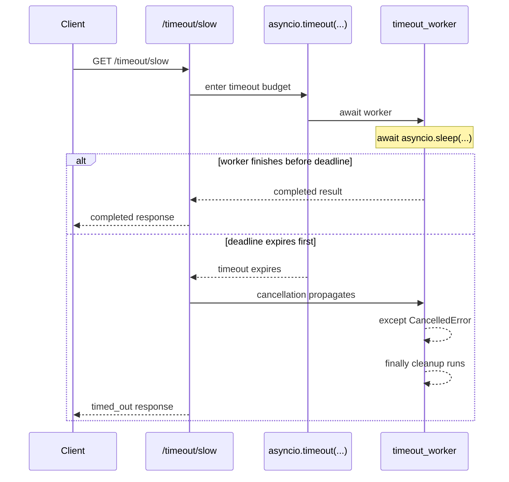
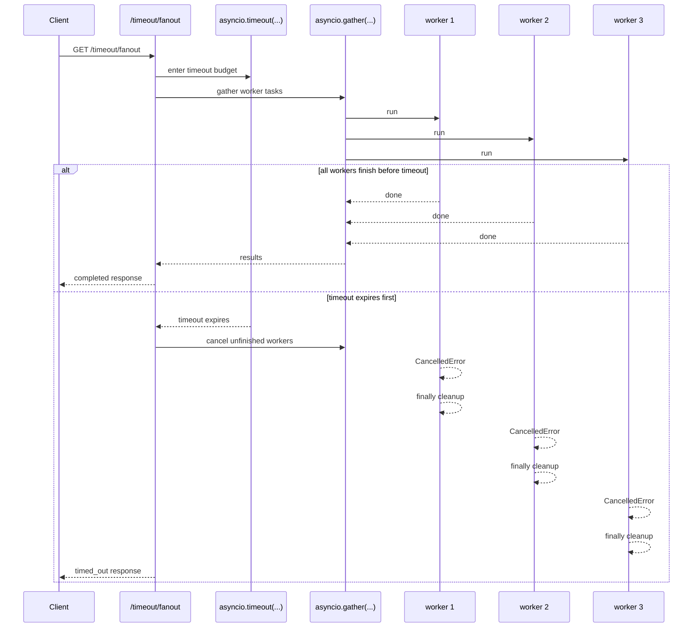

## Experiment: `/timeout/slow` and `/timeout/fanout`

Date: 2026-04-11

Goal: understand that a timeout in `asyncio` is not just a latency limit. It is a **cancellation boundary**.

This tutorial matches the Learning Goal 4 section in [app/main.py](/Users/yao/projects/fastapi-load-testing/app/main.py).


## What this section in `app/main.py` does

The relevant code has three pieces:

- `timeout_worker(...)`: a worker coroutine that logs start, completion, cancellation, and cleanup
- `GET /timeout/slow`: runs one worker under `asyncio.timeout(...)`
- `GET /timeout/fanout`: starts many workers, then applies one request-level timeout to the whole fan-out

That combination teaches the two main timeout cases:

- cancelling one slow awaitable
- cancelling a whole set of in-flight child tasks


## The worker: where cancellation becomes visible

`timeout_worker(...)` is the core teaching primitive.

- `try`: does the awaited work
- `except asyncio.CancelledError`: logs that cancellation actually reached the coroutine
- `finally`: proves cleanup still runs even when the coroutine is interrupted

That structure matters because many async bugs only show up during cancellation, not during the happy path.


## Sequence diagram: `GET /timeout/slow`

Key idea: one request, one inner coroutine, one timeout budget.




## Sequence diagram: `GET /timeout/fanout`

Key idea: one timeout at the request level can cancel many unfinished child tasks at once.




## Why the logs matter

These endpoints are intentionally instrumented with:

- start logs
- end logs
- cancelled logs
- cleanup logs

The response JSON tells you the final outcome. The logs tell you the lifecycle.

For this experiment, the lifecycle is the real lesson.


## Observed run output

The following output was captured on 2026-04-11 while running the API and Locust together. It shows three important phases:

- service startup
- a successful `/timeout/fanout` request where all 15 workers finished before the 500 ms timeout
- repeated `/timeout/slow` requests where the 1000 ms worker was cancelled by the 500 ms timeout

```text
Started parent process [10]
locust-1  | [2026-04-11 09:22:45,162] b3603637d722/INFO/locust.main: Starting Locust 2.43.4
locust-1  | [2026-04-11 09:22:45,162] b3603637d722/INFO/locust.main: Starting web interface at http://0.0.0.0:8089, press enter to open your default browser.
api-1     | INFO:     Started server process [13]
api-1     | INFO:     Waiting for application startup.
api-1     | INFO:     Application startup complete.
api-1     | INFO:     Started server process [12]
api-1     | INFO:     Waiting for application startup.
api-1     | INFO:     Application startup complete.
api-1     | /queue worker 1: started
api-1     | /queue worker 2: started
api-1     | /timeout worker 1: start delay_ms=300
api-1     | /timeout worker 2: start delay_ms=300
api-1     | /timeout worker 3: start delay_ms=300
api-1     | /timeout worker 4: start delay_ms=300
api-1     | /timeout worker 5: start delay_ms=300
api-1     | /timeout worker 6: start delay_ms=300
api-1     | /timeout worker 7: start delay_ms=300
api-1     | /timeout worker 8: start delay_ms=300
api-1     | /timeout worker 9: start delay_ms=300
api-1     | /timeout worker 10: start delay_ms=300
api-1     | /timeout worker 11: start delay_ms=300
api-1     | /timeout worker 12: start delay_ms=300
api-1     | /timeout worker 13: start delay_ms=300
api-1     | /timeout worker 14: start delay_ms=300
api-1     | /timeout worker 15: start delay_ms=300
api-1     | /timeout worker 1: end duration_ms=300.99
api-1     | /timeout worker 1: cleanup cleanup_ms=301.1
api-1     | /timeout worker 2: end duration_ms=301.09
api-1     | /timeout worker 2: cleanup cleanup_ms=301.1
api-1     | /timeout worker 3: end duration_ms=301.07
api-1     | /timeout worker 3: cleanup cleanup_ms=301.07
api-1     | /timeout worker 4: end duration_ms=301.07
api-1     | /timeout worker 4: cleanup cleanup_ms=301.07
api-1     | /timeout worker 5: end duration_ms=301.06
api-1     | /timeout worker 5: cleanup cleanup_ms=301.07
api-1     | /timeout worker 6: end duration_ms=301.06
api-1     | /timeout worker 6: cleanup cleanup_ms=301.07
api-1     | /timeout worker 7: end duration_ms=301.01
api-1     | /timeout worker 7: cleanup cleanup_ms=301.02
api-1     | /timeout worker 8: end duration_ms=301.02
api-1     | /timeout worker 8: cleanup cleanup_ms=301.02
api-1     | /timeout worker 9: end duration_ms=301.02
api-1     | /timeout worker 9: cleanup cleanup_ms=301.03
api-1     | /timeout worker 10: end duration_ms=301.03
api-1     | /timeout worker 10: cleanup cleanup_ms=301.04
api-1     | /timeout worker 11: end duration_ms=301.04
api-1     | /timeout worker 11: cleanup cleanup_ms=301.05
api-1     | /timeout worker 12: end duration_ms=301.06
api-1     | /timeout worker 12: cleanup cleanup_ms=301.06
api-1     | /timeout worker 13: end duration_ms=301.07
api-1     | /timeout worker 13: cleanup cleanup_ms=301.07
api-1     | /timeout worker 14: end duration_ms=301.1
api-1     | /timeout worker 14: cleanup cleanup_ms=301.1
api-1     | /timeout worker 15: end duration_ms=301.07
api-1     | /timeout worker 15: cleanup cleanup_ms=301.08
api-1     | /timeout/fanout: completed num_tasks=15 delay_ms=300 timeout_ms=500 completed_tasks=15 total_ms=302.26
api-1     | INFO:     192.168.65.1:25057 - "GET /timeout/fanout HTTP/1.1" 200 OK
api-1     | /queue worker 1: started
api-1     | /queue worker 2: started
api-1     | /timeout worker 1: start delay_ms=1000
api-1     | /timeout worker 1: cancelled duration_ms=500.01
api-1     | /timeout worker 1: cleanup cleanup_ms=500.03
api-1     | /timeout/slow: timed_out delay_ms=1000 timeout_ms=500 total_ms=500.45
api-1     | INFO:     192.168.65.1:29801 - "GET /timeout/slow HTTP/1.1" 200 OK
api-1     | /timeout worker 1: start delay_ms=1000
api-1     | /timeout worker 1: cancelled duration_ms=502.09
api-1     | /timeout worker 1: cleanup cleanup_ms=502.13
api-1     | /timeout/slow: timed_out delay_ms=1000 timeout_ms=500 total_ms=502.19
api-1     | INFO:     192.168.65.1:32131 - "GET /timeout/slow HTTP/1.1" 200 OK
api-1     | /timeout worker 1: start delay_ms=1000
api-1     | /timeout worker 1: cancelled duration_ms=519.05
api-1     | /timeout worker 1: cleanup cleanup_ms=519.13
api-1     | /timeout/slow: timed_out delay_ms=1000 timeout_ms=500 total_ms=519.18
api-1     | INFO:     192.168.65.1:41930 - "GET /timeout/slow HTTP/1.1" 200 OK
api-1     | /timeout worker 1: start delay_ms=1000
api-1     | /timeout worker 1: cancelled duration_ms=500.93
api-1     | /timeout worker 1: cleanup cleanup_ms=500.98
api-1     | /timeout/slow: timed_out delay_ms=1000 timeout_ms=500 total_ms=501.06
api-1     | INFO:     192.168.65.1:57570 - "GET /timeout/slow HTTP/1.1" 200 OK
```

What this output proves:

- `/timeout/fanout` completed because all 15 workers finished in about 301 ms, which stayed inside the 500 ms timeout budget
- each completed worker still executed its cleanup path
- `/timeout/slow` timed out at about 500 to 519 ms, well before the 1000 ms sleep could complete
- cancellation was not silent: the worker logged `cancelled`, then still logged cleanup
- the HTTP response was still `200 OK` because the endpoint returns a structured timeout result instead of surfacing a server error


## What to observe from `/timeout/slow`

If `delay_ms < timeout_ms`:

- the worker starts
- the worker finishes normally
- cleanup still runs
- the response is `completed`

If `delay_ms > timeout_ms`:

- the worker starts
- the timeout expires while the worker is still awaiting
- the worker receives `CancelledError`
- cleanup still runs in `finally`
- the response is `timed_out`


## What to observe from `/timeout/fanout`

If all tasks fit inside the budget:

- all workers complete
- no worker is cancelled
- the response is `completed`

If the timeout expires first:

- unfinished workers are cancelled
- each cancelled worker should still hit its cleanup path
- the response is `timed_out`

This is the key difference from `/timeout/slow`: one deadline now affects a whole fan-out tree.


## Real-world applications

### 1. A single slow downstream dependency

`/timeout/slow` maps directly to:

- one HTTP call to another service
- one Redis call
- one database query
- one model inference request

Why the timeout matters:

- the request should not wait forever
- the in-flight awaitable should stop once the budget is gone
- cleanup must still happen

### 2. API aggregation with parallel subcalls

`/timeout/fanout` maps directly to:

- fetch profile
- fetch orders
- fetch recommendations
- fetch feature flags

all inside one client request

Why the timeout matters:

- the whole request has one latency budget
- unfinished sibling tasks should not keep burning resources after the budget is already lost

### 3. AI orchestration and retrieval pipelines

One request may fan out across:

- embedding lookups
- vector search
- metadata fetches
- model calls

Why the timeout matters:

- expensive child tasks should stop when the parent request times out
- cancellation propagation is part of cost control, not just latency control


## Common mistakes

- Swallowing `CancelledError` and pretending the work succeeded.
- Forgetting `finally`, which leaks cleanup.
- Thinking timeout means "the work just keeps going safely in the background."
- Looking only at the JSON response and not at the cancellation logs.


## Practical takeaway

`/timeout/slow` teaches: one timeout can cancel one slow awaitable.

`/timeout/fanout` teaches: one timeout can cancel many unfinished child tasks together.

That is the lesson to carry into production systems:

- define request budgets
- propagate cancellation
- write cleanup that still runs under interruption
