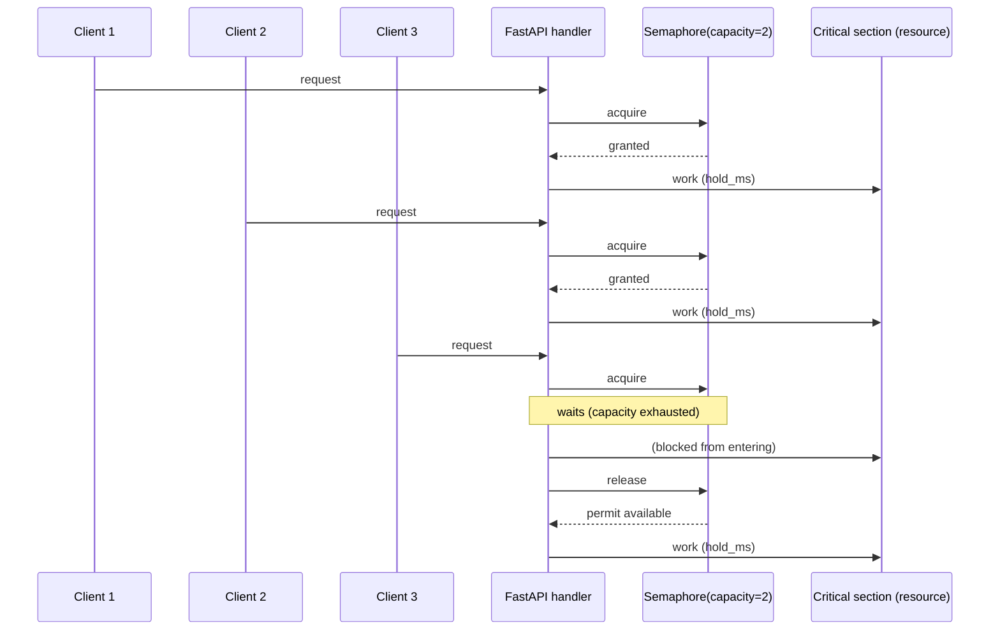

## Experiment: bounded shared resource with `asyncio.Semaphore`

Date: 2026-04-10

Goal: simulate a **fixed-capacity downstream resource** (DB pool / external API / shared GPU) and observe what happens when request concurrency exceeds that capacity.


## What you will build (no implementation here)

Add an endpoint that models “do a little async work, then enter a bottlenecked critical section”.

Suggested endpoint shape (naming critique below):

- **`GET /semaphore/resource`**: wraps a critical section in a semaphore

Recommended query params:

- `capacity`: semaphore permits (e.g., 2, 5, 10)
- `hold_ms`: how long the critical section holds the permit (simulates DB query time)
- `outside_ms`: optional async work outside the semaphore (simulates request parsing / cache check)


## Sequence diagram: bounded resource with a semaphore

Key idea: tasks beyond `capacity` **wait** before entering the critical section. This prevents overload but increases tail latency when demand is high.




## Implementation instructions (no code)

### Endpoint shape and naming critique

- For a learning repo, `/semaphore/resource` is readable and explicit.
- Alternative that is arguably “cleaner API shape” (but less explicit for the lab) is `/resource/bounded` with `capacity` as a param. I’d keep the semaphore keyword in the path for now since the repo is about asyncio primitives.

### Where the semaphore should live

- Use **one shared semaphore instance per process** (module-level or created at startup), so all requests contend for the same “pool”.
- If you create the semaphore inside the request handler, you won’t simulate shared contention (every request gets its own capacity), which defeats the point.

### What to measure / return

- `capacity`, `hold_ms`, `outside_ms`
- `wait_ms`: time spent waiting to acquire the semaphore
- `in_cs_ms`: time spent inside the critical section
- `total_ms`: total handler time

### Logging / observability

- Log one structured summary per request: capacity + wait time + total time.
- Under load, you should see wait times increase once concurrency exceeds capacity.

### What to expect under load

- **Throughput** should flatten around what the critical section can sustain.
- **p95/p99 latency** should grow as queueing happens at the semaphore.
- If `hold_ms` is purely async (e.g., `await asyncio.sleep(...)`), the event loop stays responsive; you’re modeling a *capacity gate*, not CPU contention.

### Common pitfalls

- Using blocking calls inside the critical section (e.g., `time.sleep`) will block the event loop and confound results.
- Returning before releasing a permit (exceptions) will leak permits and eventually deadlock. Plan a `try/finally` structure.


## Observed manual run

Manual endpoint under test in this repo:

- `GET /bounded/semaphore`
- `capacity = 2`
- `hold_seconds = 5`
- `outside_seconds = 0`

Observed responses from three near-concurrent `curl` calls:

```json
{"status":"ok","capacity":2,"hold_seconds":5,"outside_seconds":0,"wait_ms":0.96,"in_cs_ms":5006.29,"total_ms":5009.68}
{"status":"ok","capacity":2,"hold_seconds":5,"outside_seconds":0,"wait_ms":0.03,"in_cs_ms":4999.97,"total_ms":5000.07}
{"status":"ok","capacity":2,"hold_seconds":5,"outside_seconds":0,"wait_ms":3546.31,"in_cs_ms":5004.71,"total_ms":8551.16}
```

What this shows:

- The first two requests got permits immediately, so `wait_ms` was effectively zero.
- Each of those two requests spent about 5 seconds inside the critical section, matching `hold_seconds = 5`.
- The third request could not enter immediately because both permits were occupied, so it waited about 3.5 seconds before entering.
- Its `total_ms` is therefore roughly `wait_ms + in_cs_ms`.

Interpretation:

- This is the expected semaphore pattern for capacity `2`: two requests enter, later requests queue.
- The third request did not wait a full 5 seconds, which likely means the three `curl` calls were started slightly staggered rather than at the exact same instant.
- If all three arrived at the same moment on one worker, you would expect the third request's `wait_ms` to be closer to 5000 ms.

What to verify next:

- Re-run the same test with a single Uvicorn worker and then with two workers.
- With one worker, `capacity = 2` means only two requests can be in the critical section at once for that process.
- With two workers and a module-level semaphore, effective total capacity is roughly `2 * 2 = 4`, because each worker has its own semaphore.
