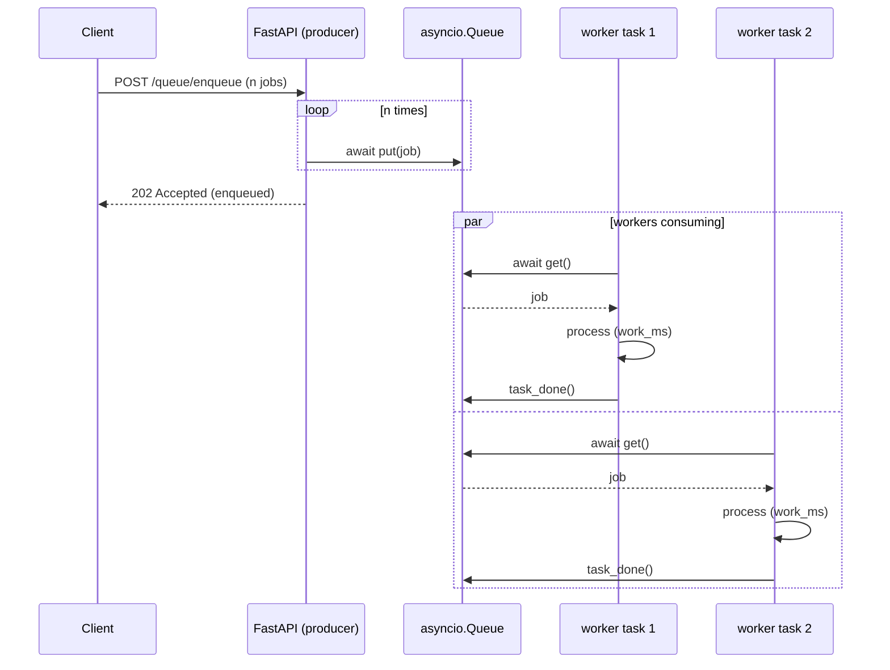
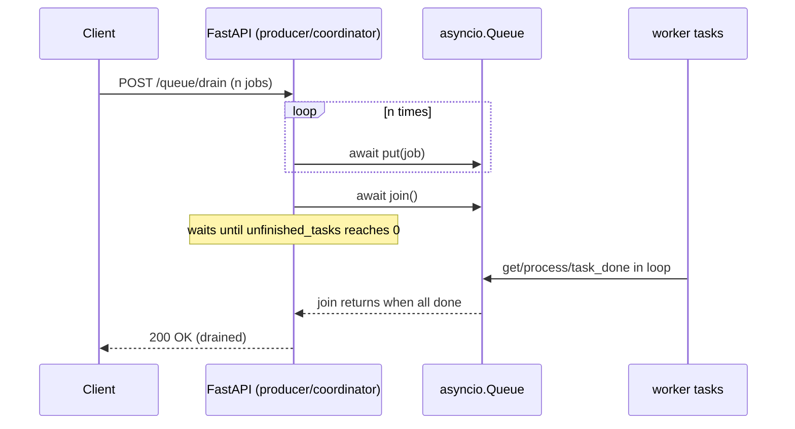
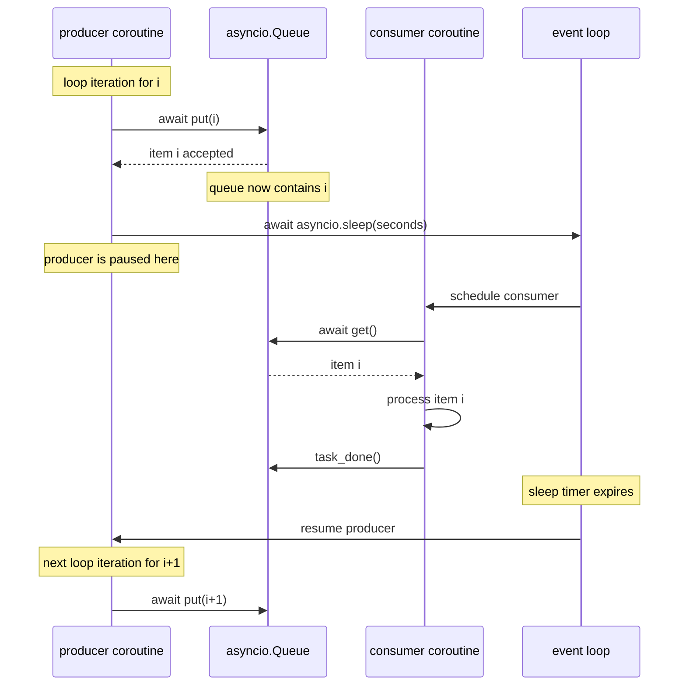
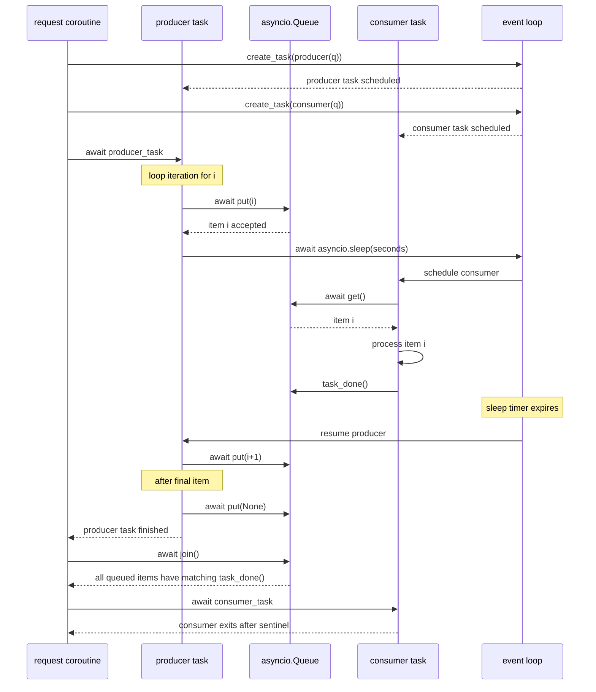

## Experiment: producer-consumer with `asyncio.Queue`

Date: 2026-04-10

Goal: learn a practical in-process producer/consumer pattern using `asyncio.Queue`, multiple worker tasks, and a “wait for drain” join step.

This is not a distributed message broker. It’s a **single-process** pattern (per Uvicorn worker) meant to teach coordination and backpressure.


## What you will build (no implementation here)

Suggested minimal API shape (naming critique below):

- **`POST /queue/enqueue`**: enqueue \(N\) jobs into an in-memory `asyncio.Queue`
- **`POST /queue/drain`**: enqueue jobs and **wait until they are processed** (demonstrates `queue.join()`)
- Optional: **`GET /queue/stats`**: return queue size and worker counters (for debugging)

Suggested payload/params:

- `n`: number of jobs to enqueue
- `work_ms`: simulated per-job async work time
- `workers`: number of worker tasks (fixed at startup is also fine)
- Optional: `maxsize`: queue maxsize to demonstrate producer backpressure


## Sequence diagram: enqueue then background workers consume

Key idea: producer enqueues quickly; workers consume over time.




## Sequence diagram: enqueue and wait for drain (`queue.join()`)

Key idea: `queue.join()` is a *fan-in* barrier: it resumes only when all enqueued jobs have had matching `task_done()` calls.




## Implementation instructions (no code)

### Endpoint shape and naming critique

- `/queue/enqueue` and `/queue/drain` are explicit for a lab.
- If you want a more “RESTy” shape later: `POST /jobs` and `POST /jobs:drain` (action endpoint) or `POST /jobs?wait=true`. For now, clarity > purity.

### Where to create the queue and workers

- Create **one shared `asyncio.Queue` per process** (module-level or via FastAPI lifespan).
- Start a fixed number of **worker tasks** at startup and keep them running until shutdown.
- Under multi-worker Uvicorn, each process has its own queue/workers—document that expectation (it’s a teaching point).

### Job payload design

Each job can be:

- Just an integer id, or
- A tiny dict with `job_id` + `work_ms` + `created_at_ms`

Return from enqueue endpoints:

- `enqueued`: number of jobs
- `queue_size`: current size after enqueue (approximate signal)
- Optional: `request_id` or timestamp for correlating logs

### Backpressure knobs to include

- `Queue(maxsize=...)`: when full, `put()` awaits, slowing producers naturally.
- Semaphore is a different knob (limits concurrency), queue maxsize limits backlog. Both are useful in different experiments.

### Worker behavior essentials

- Infinite loop: `job = await queue.get()`
- `try/finally` to ensure `task_done()` is always called even if processing fails.
- Plan a shutdown strategy (cancel tasks on app shutdown).

### What to expect under load

- With small `maxsize`, producers will block sooner, increasing request latency but preventing unbounded memory growth.
- Increasing worker count reduces drain time only if work yields (async sleep / I/O). For CPU-bound work, adding async workers won’t help without offloading.

### Common pitfalls

- Forgetting `task_done()` causes `join()` to hang forever.
- Creating workers per request spawns unbounded background tasks and breaks the experiment.


## 6.2.1 Sequence diagram: request awaits producer, consumer runs as a task

This matches the toy shape:

```python
consumer_task = asyncio.create_task(consumer(q))
await producer(q)
await q.join()
await consumer_task
```

Key idea: after the producer enqueues item `i`, it does **not** enqueue `i+1` immediately if the next line is `await asyncio.sleep(...)`. The sleep yields control to the event loop, which gives the consumer a chance to run first.




## 6.2.2 Sequence diagram: both producer and consumer run as tasks

This matches the more explicit shape:

```python
producer_task = asyncio.create_task(producer(q))
consumer_task = asyncio.create_task(consumer(q))
await producer_task
await q.join()
await consumer_task
```

Key idea: this is mostly the same queue behavior, but now the request coroutine is not itself "being" the producer. It becomes a coordinator that starts both tasks and then waits on them.




## What `q.join()` is for

- `q.join()` is **not** what stops the consumer. The sentinel or task cancellation stops the consumer.
- `q.join()` is a completion barrier: it waits until every queued item has been marked done with `task_done()`.
- In a toy one-request demo, `await q.join()` is useful if you want the endpoint to return only after all enqueued work is fully processed.
- In a long-lived app with background workers, `q.join()` is useful when you want to observe "drain complete" for a batch. It is not required for worker cleanup on shutdown.
- If you skip `q.join()` in the toy example, the request might finish as soon as the producer finishes enqueuing, even though the consumer is still working through the backlog.


## How this differs from the earlier diagrams

- The two diagrams at the top are **higher-level coordination diagrams**. They explain the overall pattern: producer enqueues, workers consume, and `join()` waits for all work to finish.
- `6.2.1` and `6.2.2` are **scheduler-level views**. They show the precise consequence of `await asyncio.sleep(...)`: the producer yields after putting `i`, so the consumer can run before `i+1` is enqueued.
- The earlier `/queue/enqueue` diagram can look like the producer pushes all `n` items in one uninterrupted burst. That is only true if each loop iteration can keep advancing immediately. If the producer does `await asyncio.sleep(...)` between puts, the burst is broken up into separate scheduling turns.
- The earlier `/queue/drain` diagram focuses on the `await queue.join()` barrier. `6.1` and `6.2` focus on what happens **before** that barrier, inside the producer and around task scheduling.
- None of the diagrams imply that `await q.put(i)` waits for the consumer to finish item `i`. `put()` only waits until the item is accepted into the queue, which may still be much earlier than `get()` or `task_done()`.
- The difference between `6.1` and `6.2` is mostly control flow, not queue semantics. In `6.1`, the request coroutine directly runs producer code. In `6.2`, the request coroutine acts as a coordinator and both producer and consumer are background tasks.
