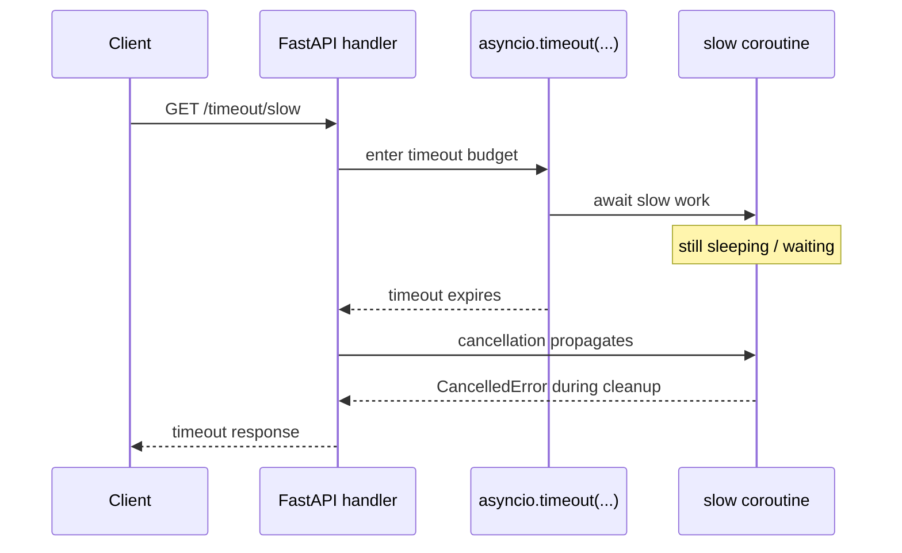
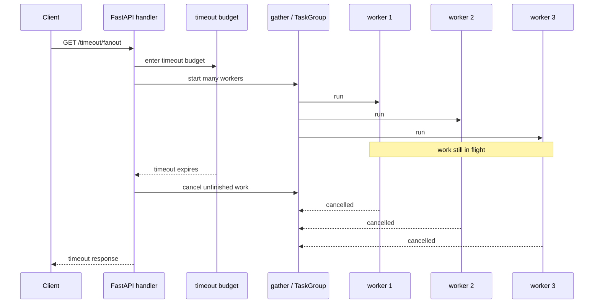

## Experiment: timeouts and cancellation boundaries

Date: 2026-04-10

Goal: learn that timeouts are not just about returning faster. In asyncio, a timeout usually means **cancelling in-flight work**, which makes cleanup and partial progress part of the experiment.

## What you will build (no implementation here)

Suggested endpoint shape:

- **`GET /timeout/slow`**: wrap one slow awaitable in a timeout budget
- **`GET /timeout/fanout`**: wrap a fan-out workload in a request-level timeout budget

Recommended query params:

- `delay_ms`: how long each inner awaitable sleeps
- `timeout_ms`: request or operation time budget
- `num_tasks`: for the fan-out case
- Optional: `fail_task`: task id that raises an exception before timeout, so you can compare timeout handling versus normal failure

## Sequence diagram: single slow awaitable hits timeout

Key idea: timeout is a control boundary. The caller stops waiting and the inner coroutine is cancelled.

## Sequence diagram: fan-out under one request-level timeout

Key idea: one deadline can cancel many in-flight subtasks.

## Implementation instructions (no code)

### What to measure / return

- `timeout_ms`
- `delay_ms`
- `num_tasks`
- `completed_tasks`
- `cancelled_tasks`
- `total_ms`
- Optional: `cleanup_ran` boolean if you instrument worker cleanup paths

### What to log

- Worker start
- Worker completion
- Worker cancellation
- Cleanup in `finally`

The logs matter here more than the final JSON response because cancellation bugs are often visible only in cleanup ordering.

### What to expect

- A timeout should stop the request from waiting forever.
- Cancellation should propagate into the inner coroutine at an `await` point.
- If cleanup is written correctly, resources should still be released even when the request times out.

### Common pitfalls

- Swallowing `CancelledError` and pretending everything succeeded.
- Forgetting `finally` cleanup, which leaks permits, queue bookkeeping, or external resources.
- Thinking timeout means “background work continues safely.” In a lab, verify whether it actually does.
