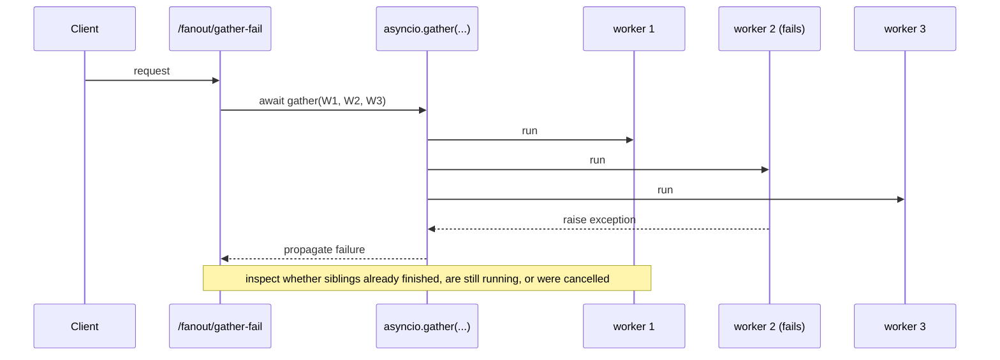
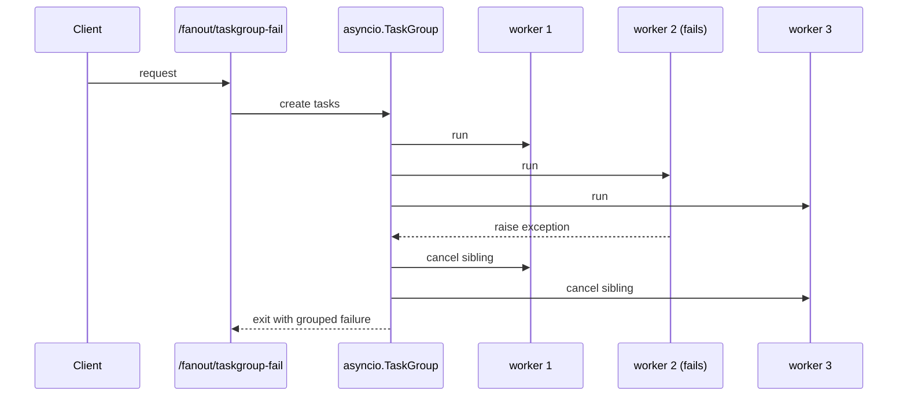

## Experiment: `asyncio.gather(...)` vs `asyncio.TaskGroup` failure propagation

Date: 2026-04-10

Goal: learn that concurrent fan-out is not only about total latency. You also need a clear model for **what happens when one subtask fails** and whether sibling tasks continue or are cancelled.

## What you will build (no implementation here)

Suggested endpoint shape:

- **`GET /fanout/gather-fail`**: run multiple workers via `asyncio.gather(...)` with one worker configured to fail
- **`GET /fanout/taskgroup-fail`**: run the same workload via `asyncio.TaskGroup`

Recommended query params:

- `num_tasks`: number of subtasks
- `delay_ms`: normal worker duration
- `fail_task`: task id that raises
- `fail_after_ms`: how long the failing worker waits before raising

## Sequence diagram: failure during `asyncio.gather(...)`

Key idea: gather joins many awaitables, but failure semantics need to be tested explicitly.

## Sequence diagram: failure during `TaskGroup`

Key idea: structured concurrency tends to make sibling-task cleanup more explicit and predictable.

## Implementation instructions (no code)

### What to measure / return

- `num_tasks`
- `fail_task`
- `completed_tasks`
- `cancelled_tasks`
- `failed_tasks`
- `total_ms`
- Optional: list of per-task terminal states

### What to log

- Worker start
- Worker success
- Worker failure
- Worker cancellation
- Any cleanup in `finally`

### What to expect

- The two endpoints may finish with the same top-level error but different sibling-task behavior.
- This matters when subtasks touch shared resources, have side effects, or need guaranteed cleanup.

### Common pitfalls

- Assuming all fan-out helpers have the same failure semantics.
- Ignoring cancellation paths in siblings after one task fails.
- Returning only the top-level exception and learning nothing about which work already happened.
