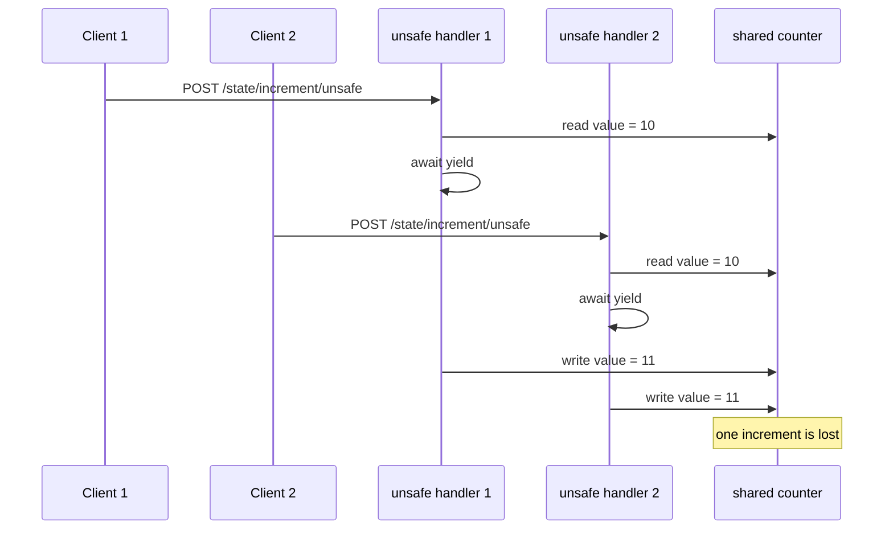
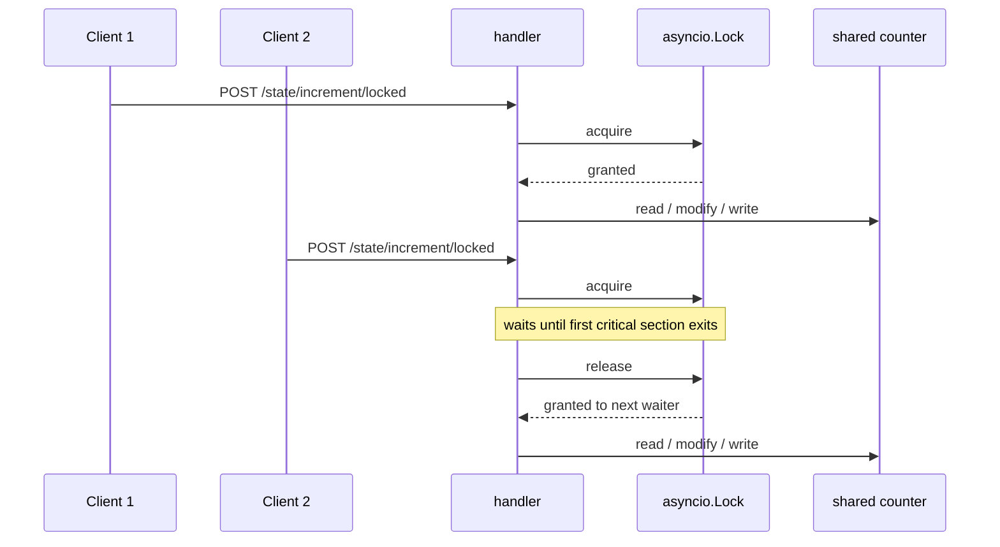

## Experiment: shared state race condition and `asyncio.Lock`

Date: 2026-04-10

Goal: learn that a single-threaded event loop does **not** eliminate race conditions. If a coroutine yields in the middle of a read-modify-write sequence, other coroutines can interleave and corrupt shared in-memory state.

## What you will build (no implementation here)

Suggested endpoint shape:

- **`POST /state/increment/unsafe`**: update a shared counter without protection
- **`POST /state/increment/locked`**: update the same counter under `asyncio.Lock`
- Optional: **`GET /state/value`**: inspect the current counter value

Recommended query params:

- `n`: number of increments per request
- `yield_ms`: artificial delay between reading and writing the counter so the race is easier to trigger

## Sequence diagram: unsafe increment loses updates

Key idea: both handlers read the same old value before either writes back.

## Sequence diagram: lock serializes the critical section

Key idea: the lock does not make work faster; it preserves correctness by preventing interleaving inside the critical section.

## Implementation instructions (no code)

### Where the shared state should live

- Use one module-level counter and one module-level `asyncio.Lock` per process.
- Document clearly that multi-worker Uvicorn means each process has its own counter and its own lock. This is an in-process correctness lab, not cross-process synchronization.

### What to measure / return

- `n`
- `yield_ms`
- `before`
- `after`
- `expected_delta`
- `observed_delta`
- `total_ms`

### What to expect

- Under concurrency, the unsafe endpoint should sometimes lose updates.
- The locked endpoint should preserve correctness, but latency may rise because requests now serialize through the critical section.

### Common pitfalls

- Assuming “single thread” means “no race conditions”.
- Holding the lock around unrelated async work and accidentally making the bottleneck larger than necessary.
- Forgetting that `asyncio.Lock` only coordinates coroutines within one process, not multiple Uvicorn workers.
