# Asyncio Sequence Diagrams

Date: 2026-04-10

Goal: build an intuition for how `async` / `await`, coroutines, tasks, queues, workers, and related asyncio primitives behave at runtime.


```
Host machine
 └ Docker Compose
    ├ api container
    │  └ uv run uvicorn app.main:app --host 0.0.0.0 --port 8000 --workers 2
    │     ├ process: uvicorn worker 1
    │     │  └ main thread
    │     │     └ asyncio event loop
    │     │        ├ FastAPI request task
    │     │        ├ FastAPI request task
    │     │        ├ shared per-process semaphore
    │     │        └ shared per-process queue / lock / state
    │     └ process: uvicorn worker 2
    │        └ main thread
    │           └ asyncio event loop
    │              ├ FastAPI request task
    │              ├ FastAPI request task
    │              ├ shared per-process semaphore
    │              └ shared per-process queue / lock / state
    └ locust container
       └ locust users generate concurrent HTTP requests
```

Important hierarchy:

- Processes sit above threads here.
- Each Uvicorn worker is a separate process.
- Each worker process has its own main thread and its own asyncio event loop.
- Asyncio primitives like `Semaphore`, `Lock`, and `Queue` live inside one process unless you use an external shared system.
- A module-level semaphore is shared by requests in one worker process, not across all workers.


## 0. Current runtime entry points in this repo

These are the control points that currently shape what the diagrams mean at runtime.

- Docker Compose starts the API service from [docker-compose.yml](/Users/yao/projects/fastapi-load-testing/docker-compose.yml#L2).
- The API service is capped at `cpus: "1.0"` and `mem_limit: "512m"` in [docker-compose.yml](/Users/yao/projects/fastapi-load-testing/docker-compose.yml#L5).
- The API command is `uv run uvicorn app.main:app --host 0.0.0.0 --port 8000 --workers 2` in [docker-compose.yml](/Users/yao/projects/fastapi-load-testing/docker-compose.yml#L10) and [Dockerfile](/Users/yao/projects/fastapi-load-testing/Dockerfile#L19).
- That `--workers 2` setting means there are two separate worker processes.
- The Locust service points at `http://api:8000` from [docker-compose.yml](/Users/yao/projects/fastapi-load-testing/docker-compose.yml#L44).
- The FastAPI app is assembled in [app/main.py](/Users/yao/projects/fastapi-load-testing/app/main.py).
- Tutorial request handlers are defined in [app/api/tutorials_async.py](/Users/yao/projects/fastapi-load-testing/app/api/tutorials_async.py), including `/tutorials/async/sleep/*`, `/tutorials/async/cpu/*`, and `/tutorials/async/fanout/*`.

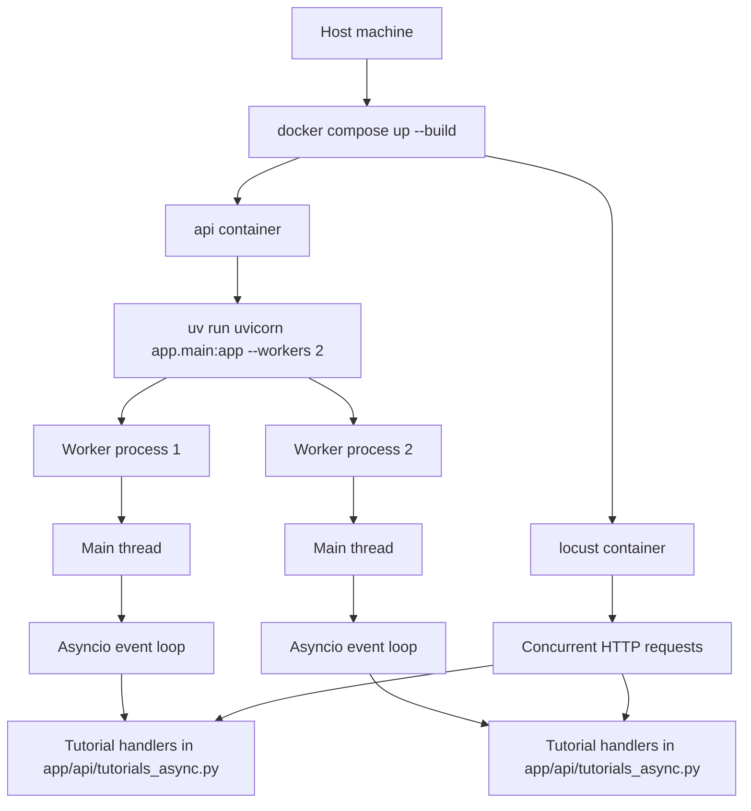


## 0.1 Function-level control points in `app/api/tutorials_async.py`

Right now the main runtime behaviors in [app/api/tutorials_async.py](/Users/yao/projects/fastapi-load-testing/app/api/tutorials_async.py#L1) break down like this:

- `/tutorials/async/sleep/blocking` calls `time.sleep(...)` and blocks the worker thread.
- `/tutorials/async/sleep/async` calls `await asyncio.sleep(...)` and yields the event loop.
- `/tutorials/async/cpu/inline` runs CPU work directly in the handler.
- `/tutorials/async/cpu/to-thread` offloads CPU work with `asyncio.to_thread(...)`.
- `/tutorials/async/fanout/sequential` awaits each child one by one.
- `/tutorials/async/fanout/gather` schedules child coroutines together with `asyncio.gather(...)`.
- Tutorial 05 uses the semaphore-backed runtime in [app/core/tutorial_runtime.py](/Users/yao/projects/fastapi-load-testing/app/core/tutorial_runtime.py) together with the route in [app/api/tutorials_async.py](/Users/yao/projects/fastapi-load-testing/app/api/tutorials_async.py).

```mermaid
flowchart TD
    A[HTTP request enters FastAPI route] --> B{Handler pattern}
    B --> C[/tutorials/async/sleep/blocking/]
    B --> D[/tutorials/async/sleep/async/]
    B --> E[/tutorials/async/cpu/inline/]
    B --> F[/tutorials/async/cpu/to-thread/]
    B --> G[/tutorials/async/fanout/sequential/]
    B --> H[/tutorials/async/fanout/gather/]
    B --> I[/semaphore/resource/ tutorial]
    C --> C1[time.sleep blocks worker thread]
    D --> D1[await asyncio.sleep yields loop]
    E --> E1[CPU loop runs inline in event loop thread]
    F --> F1[blocking CPU work moves to thread worker]
    G --> G1[child tasks run one after another]
    H --> H1[child tasks run concurrently on same loop]
    I --> I1[critical section admits only N tasks per worker]
```


## 1. `async def` and `await`

Key idea:

- `async def` defines a coroutine function.
- Calling it creates a coroutine object.
- The coroutine does not make progress until the event loop runs it.
- `await` suspends the current coroutine and lets the event loop run something else.

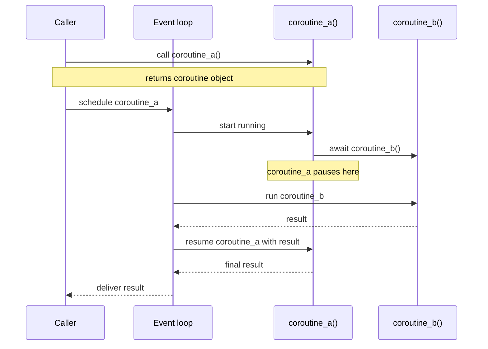


## 2. Coroutine object versus Task

Key idea:

- A coroutine object is just a resumable computation.
- A `Task` is the event loop actively managing that coroutine.
- `asyncio.create_task(...)` turns a coroutine into scheduled concurrent work.

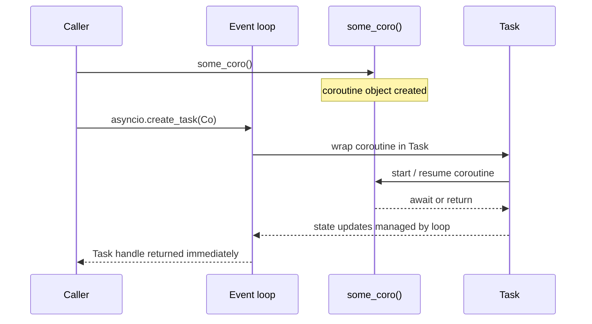


## 3. Awaiting directly versus creating a Task

Key idea:

- `await coro()` means "pause here until this finishes."
- `create_task(coro())` means "let this run concurrently while I keep going."

```mermaid
sequenceDiagram
    participant P as parent()
    participant L as Event loop
    participant C1 as child()
    participant T as Task(child)

    rect rgb(0, 0, 0)
        P->>C1: await child()
        Note over P: parent pauses immediately
        L->>C1: run child
        C1-->>P: result
    end

    rect rgb(0, 0, 0)
        P->>L: create_task(child())
        L->>T: schedule Task
        L-->>P: Task returned immediately
        Note over P: parent keeps running
        T->>T: child executes concurrently
    end
```


## 4. `asyncio.gather(...)` fan-out and fan-in

Key idea:

- `gather(...)` schedules multiple awaitables together.
- The caller suspends once, then resumes after all results are ready.

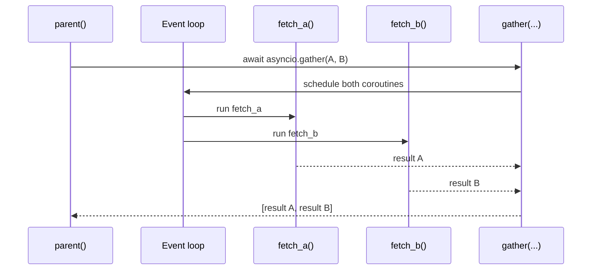


## 5. Event loop interleaving at `await` points

Key idea:

- Async concurrency is cooperative.
- Switching happens when a coroutine awaits something that is not ready yet.
- If code never awaits, it can monopolize the loop.

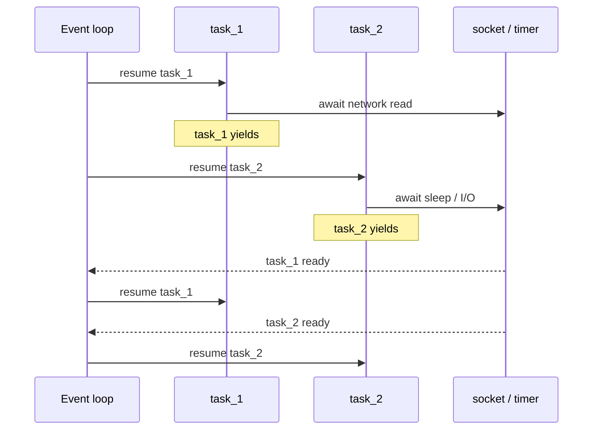


## 6. Queue with producer and workers

Key idea:

- `asyncio.Queue` decouples producers from consumers.
- Producers `put(...)` work items into the queue.
- Worker tasks `get()` items, process them, then call `task_done()`.

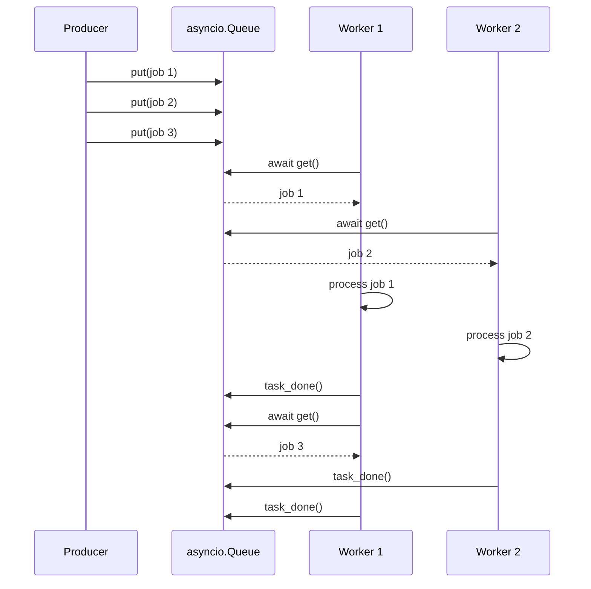


## 7. Waiting for a queue to drain with `queue.join()`

Key idea:

- `queue.join()` waits until every queued item has a matching `task_done()`.
- This is how a coordinator can wait for all enqueued work to finish.

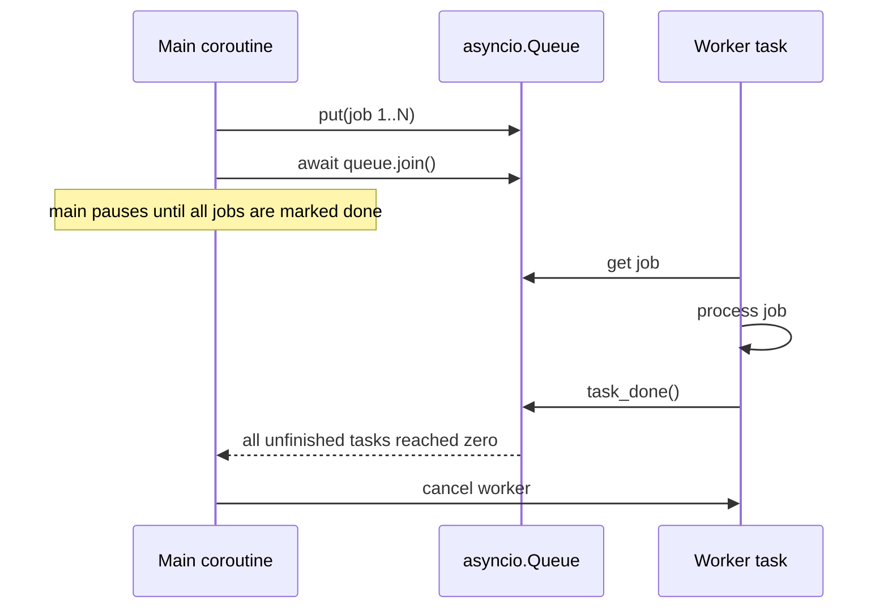


## 8. Semaphore limiting concurrency

Key idea:

- A semaphore is a gate that limits how many coroutines may enter a critical section at once.
- This is useful for DB pools, rate-limited APIs, or bounded downstream capacity.
- In this repo, a module-level semaphore inside `app.main` would be shared only within one Uvicorn worker process.

Hierarchy placement:

- Host
- Container
- Uvicorn worker process
- Main thread
- Asyncio event loop
- FastAPI request tasks
- Semaphore guarding a critical section used by those tasks

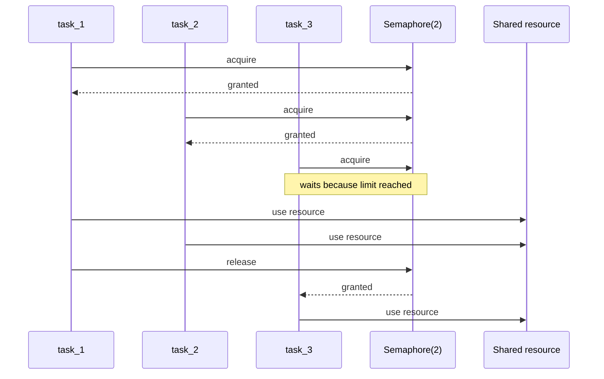

```mermaid
flowchart TD
    A[api container] --> B[uvicorn master process]
    B --> C[worker process 1]
    B --> D[worker process 2]
    C --> E[main thread]
    D --> F[main thread]
    E --> G[event loop]
    F --> H[event loop]
    G --> I[module-level semaphore in worker 1]
    H --> J[module-level semaphore in worker 2]
    I --> K[task A critical section]
    I --> L[task B critical section]
    J --> M[task C critical section]
    J --> N[task D critical section]
```

Expected consequence for tutorial 05:

- If semaphore capacity is `2` and Uvicorn has `2` workers, the app can admit about `4` concurrent critical-section entries overall.
- Requests compete with the semaphore only against other requests that landed in the same worker process.
- If you want one truly global limit, you need an external coordinator, not just an in-process asyncio primitive.


## 9. Offloading blocking work with `asyncio.to_thread(...)`

Key idea:

- The event loop stays responsive because the blocking function runs in a worker thread.
- This helps protect unrelated async work from being stuck behind blocking code.

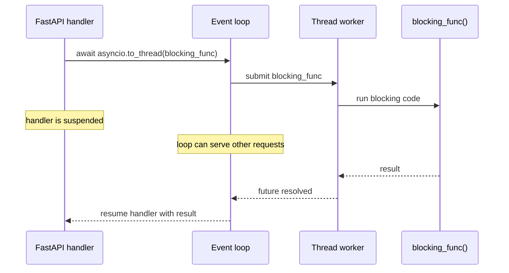


## 10. Cancellation flow

Key idea:

- Cancelling a task raises `CancelledError` inside that coroutine at the next await point.
- Well-behaved coroutines clean up and then re-raise or exit.

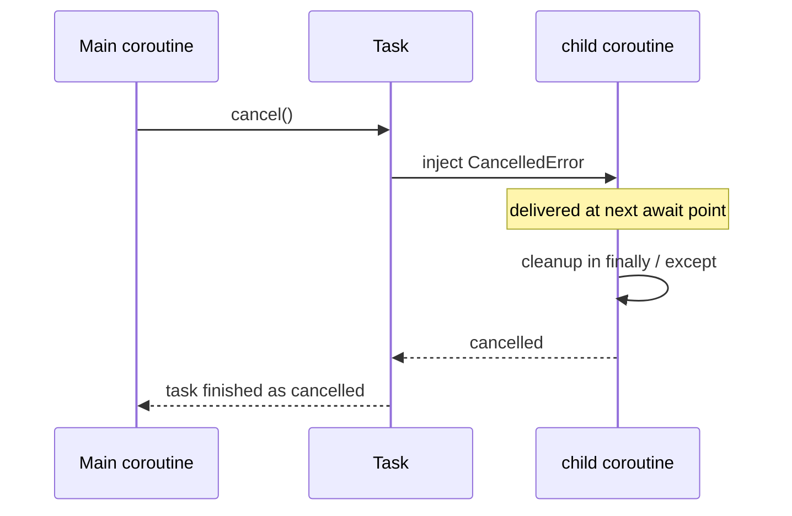


## Reading Guide

Use these diagrams as a mental model:

- If a coroutine is `await`ing, the loop may run other work.
- If code is CPU-bound and never yields, it blocks progress on that loop thread.
- Tasks are the event loop's units of scheduled coroutine execution.
- Queues and semaphores are coordination tools, not magic performance tools.
- Worker patterns help organize concurrency, but they still depend on where blocking happens.


## DB stuff:
If your FastAPI request handlers are async, prefer an async DB driver or async
  ORM session for request-path queries. That avoids blocking the event loop
  while waiting on the database. In that setup:

  - Use async clients/sessions in async def routes.
  - Keep transactions short.
  - Create one session per request or per unit of work.
  - Reuse a connection pool instead of opening connections per query.
  - Set query timeouts and pool limits.
  - Avoid N+1 query patterns because async does not fix bad query shape.

  If your DB library is synchronous:

  - It is fine in a synchronous app.
  - In an async app, do not call it directly inside async def handlers if
    queries are nontrivial.
  - If you must use it temporarily, offload with asyncio.to_thread(...), but
    that is usually a compatibility bridge, not the ideal long-term design.

  Best-practice split:

  - Async app + async DB driver: best for high-concurrency I/O-bound APIs.
  - Sync app + sync DB driver: simpler and often perfectly fine.
    volume/noncritical paths.

  A few practical rules:

  - Keep business logic outside the ORM/session layer where possible.
  - Bound your pool size to what the database can actually handle.
  - Add retries only for clearly transient failures, not blindly.
  - Measure slow queries first; switching to async won’t rescue an inefficient
    schema or query plan.

  Short version:

  - DB calls are usually I/O-bound, so in an async web app they should usually
    be async.
  - CPU-heavy post-processing stays sync and, if needed, gets offloaded
    separately.
  - “Async everything” is not the goal; “don’t block the event loop on DB waits”
    is the goal.
