# Experiment Guide: `/tutorials/async/cpu/inline` vs `/tutorials/async/cpu/to-thread`

Date: 2026-04-10

Goal: observe the difference between running CPU-bound Python work directly inside an `async def` handler versus offloading that same work with `await asyncio.to_thread(...)`.

Main question:
- Does `async def` alone help with CPU-bound work?
- Does `asyncio.to_thread(...)` improve responsiveness for unrelated requests like `/health`?

## Endpoint Summary

Learning goal 2:
- `GET /tutorials/async/cpu/inline`
  - Run a CPU-heavy loop directly in the request handler.
  - Confirm that async syntax does not save CPU-bound work.
- `GET /tutorials/async/cpu/to-thread`
  - Offload the same blocking CPU function with `asyncio.to_thread(...)`.
  - Measure whether responsiveness improves for other requests.

Current implementation:

```python
def run_cpu_work(iterations: int) -> int:
    total = 0
    for i in range(iterations):
        total += (i % 97) * (i % 89)
    return total


@app.get("/tutorials/async/cpu/inline")
async def cpu_inline(iterations: int = 25_000_000):
    print(f"/tutorials/async/cpu/inline: Running CPU-heavy loop for {iterations} iterations")
    checksum = run_cpu_work(iterations)
    return {"status": "ok", "iterations": iterations, "checksum": checksum}


@app.get("/tutorials/async/cpu/to-thread")
async def cpu_to_thread(iterations: int = 25_000_000):
    print(f"/tutorials/async/cpu/to-thread: Running CPU-heavy loop for {iterations} iterations")
    checksum = await asyncio.to_thread(run_cpu_work, iterations)
    return {"status": "ok", "iterations": iterations, "checksum": checksum}
```

## Why This Experiment Matters

`async def` only helps when the code reaches an `await` point that yields control back to the event loop.

For pure CPU work:
- `/tutorials/async/cpu/inline` never yields while the loop is running.
- `/tutorials/async/cpu/to-thread` moves the loop off the event-loop thread, so the main loop can keep servicing other work.

Important caveat:
- `asyncio.to_thread(...)` does not make pure Python CPU work faster.
- Because of the GIL, it usually improves responsiveness more than raw throughput.

## Setup

Run the app locally with one Uvicorn worker:

```bash
uv run uvicorn app.main:app --host 0.0.0.0 --port 8000
```

Use two terminals:
- Terminal 1: start the CPU-heavy request
- Terminal 2: send `/health` while Terminal 1 is still in progress

If the default iteration count finishes too quickly or too slowly on your machine, pass a custom query param such as `iterations=50000000`.

## Experiment 1: inline CPU work

Terminal 1:

```bash
time curl "http://localhost:8000/tutorials/async/cpu/inline?iterations=25000000"
```

While that request is still running, Terminal 2:

```bash
time curl "http://localhost:8000/health"
```

What to look for:
- `/tutorials/async/cpu/inline` should keep one worker busy in Python code the whole time.
- `/health` will often be delayed noticeably because the event-loop thread is occupied by the CPU loop.
- This demonstrates that `async def` does not automatically make CPU-bound handlers non-blocking.

## Experiment 2: offload CPU work with `to_thread`

Terminal 1:

```bash
time curl "http://localhost:8000/tutorials/async/cpu/to-thread?iterations=25000000"
```

While that request is still running, Terminal 2:

```bash
time curl "http://localhost:8000/health"
```

What to look for:
- `/tutorials/async/cpu/to-thread` still takes substantial time, because the same CPU work is still being done.
- `/health` should usually respond faster than with `/tutorials/async/cpu/inline`, because the event loop itself is not trapped inside the loop.
- The improvement may be partial rather than perfect, because the background worker thread still competes for the GIL.

## Expected Interpretation

Expected result:
- `/tutorials/async/cpu/inline` is the worst case for unrelated request latency in a single-worker process.
- `/tutorials/async/cpu/to-thread` can improve responsiveness for unrelated I/O-oriented requests, but it is not true parallel CPU acceleration for pure Python loops.

Main takeaway:
- Async syntax helps with waiting, not with heavy CPU work by itself.
- `asyncio.to_thread(...)` is useful when you need to keep the event loop responsive.
- For real CPU scaling, you usually need more processes, native extensions that release the GIL, or an external worker system.

## Sequence Diagram

```mermaid
sequenceDiagram
    participant T1 as Terminal 1
    participant T2 as Terminal 2
    participant U as Uvicorn worker
    participant E as Event loop thread
    participant W as Worker thread

    rect rgb(0, 0, 0)
        T1->>U: GET /tutorials/async/cpu/inline
        U->>E: dispatch request
        E->>E: run_cpu_work(iterations)
        Note over E: CPU loop runs inline and does not yield
        T2->>U: GET /health
        Note over T2,U: /health waits because the event loop is busy
        E-->>U: CPU loop completes
        U-->>T1: 200 OK
        U->>E: dispatch /health
        E-->>U: 200 OK
        U-->>T2: delayed response
    end

    rect rgb(0, 0, 0)
        T1->>U: GET /tutorials/async/cpu/to-thread
        U->>E: dispatch request
        E->>W: asyncio.to_thread(run_cpu_work)
        Note over W: CPU loop runs in a background thread
        Note over E: event loop stays available for other requests
        T2->>U: GET /health
        U->>E: dispatch /health
        E-->>U: 200 OK
        U-->>T2: faster response
        W-->>E: CPU loop completes
        E-->>U: resume handler
        U-->>T1: 200 OK
    end
```



## Suggested Next Runs

- Repeat both tests with two Uvicorn workers and compare behavior.
- Add both CPU endpoints to Locust and compare `/health` p95 and p99 under mixed traffic.
- Compare pure Python CPU work versus a blocking function that mostly waits on I/O.
