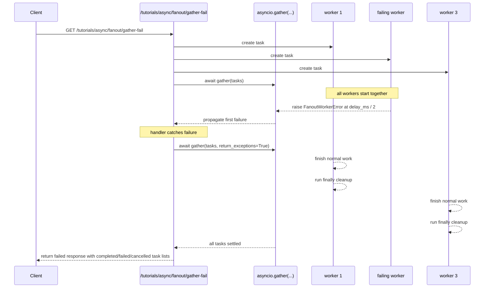
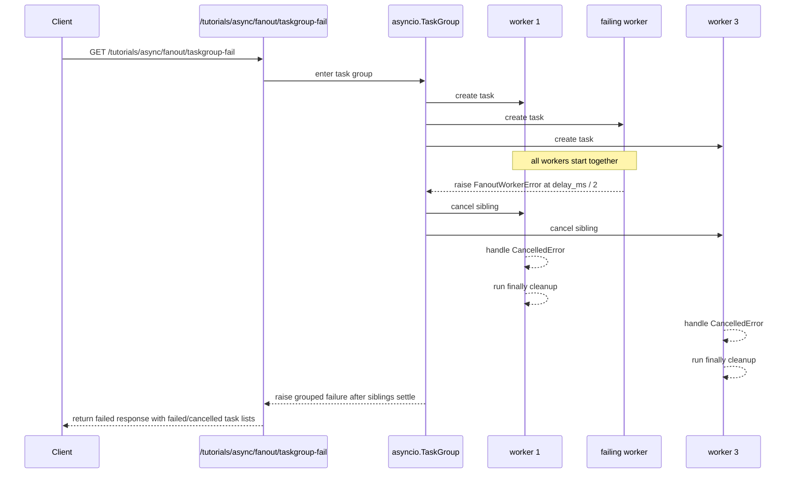

## Experiment: `asyncio.gather(...)` vs `asyncio.TaskGroup` failure propagation

Date: 2026-04-11

Goal: understand that concurrent fan-out is not only about latency. It is also about what the parent request does when one child task fails.

This tutorial matches Learning Goal 7 in [app/api/tutorials_async.py](/Users/yao/projects/fastapi-load-testing/app/api/tutorials_async.py).

## What the implementation does

Both endpoints use the same helper, [worker_with_failure](/Users/yao/projects/fastapi-load-testing/app/api/tutorials_async.py).

That worker behaves like this:

- every task starts immediately
- the designated `fail_task` sleeps for half of `delay_ms`, then raises `FanoutWorkerError`
- every non-failing sibling sleeps for the full `delay_ms`, then completes normally
- every worker logs cleanup in `finally`
- cancelled siblings log `CancelledError` before re-raising

That timing is intentional. It makes the failure happen early enough that sibling behavior becomes visible.

## The two endpoints

### `GET /tutorials/async/fanout/gather-fail`

Implementation: [gather_fail_endpoint](/Users/yao/projects/fastapi-load-testing/app/api/tutorials_async.py)

This endpoint creates all child tasks, awaits them with `asyncio.gather(...)`, and lets the first child failure surface to the request handler.

After that failure surfaces, the handler explicitly waits for all child tasks to settle with `await asyncio.gather(..., return_exceptions=True)` so the response can report final sibling state.

What to observe:

- the first failure reaches the parent quickly
- sibling tasks are not cancelled by the endpoint logic
- siblings can keep running and finish after the first failure was already known
- cleanup still runs for the failed task and for the siblings that complete

### `GET /tutorials/async/fanout/taskgroup-fail`

Implementation: [taskgroup_fail_endpoint](/Users/yao/projects/fastapi-load-testing/app/api/tutorials_async.py)

This endpoint creates the same workload inside `asyncio.TaskGroup`.

When one child fails, `TaskGroup` cancels sibling tasks, waits for their cleanup paths, and then exits by raising a grouped failure to the parent.

What to observe:

- the first child failure still happens early
- sibling tasks are cancelled instead of allowed to finish
- cancelled tasks still run their `finally` cleanup block
- the parent sees failure only after the task group has driven sibling cancellation and cleanup

## Sequence diagram: `gather(...)` path

Key idea: `gather(...)` lets the first failure reach the parent, but sibling tasks may still be running unless you choose to cancel them.

## Sequence diagram: `TaskGroup` path

Key idea: `TaskGroup` treats sibling cancellation as part of the contract when one child fails.

## What the response fields mean

Both endpoints return enough information to inspect terminal state:

- `num_tasks`: how many child tasks were started
- `fail_task`: which child was configured to fail
- `completed_tasks`: child task ids that finished normally
- `failed_tasks`: child task ids that ended with an exception
- `cancelled_tasks`: child task ids that were cancelled
- `first_exception`: the first failure surfaced to the parent request
- `total_ms`: total request time
- `task_terminal_states`: per-task terminal state summary

For `TaskGroup`, the endpoint also returns `failed_task_id` when it can identify the failing child from the grouped exception.

## What you should learn from running it

The important lesson is not just "one task failed."

It is:

- when the parent request learns about failure
- whether sibling tasks are allowed to continue doing work
- whether sibling tasks are cancelled
- whether cleanup still runs for interrupted tasks
- how the choice of concurrency primitive becomes part of your API behavior

In this implementation, the difference is intentionally visible:

- `gather-fail` returns `failed`, but siblings usually appear in `completed_tasks`
- `taskgroup-fail` returns `failed`, and siblings usually appear in `cancelled_tasks`

## Suggested experiments

### 1. Default run

Call both endpoints with the defaults.

You should see:

- `gather-fail`: one failed task, remaining siblings completed
- `taskgroup-fail`: one failed task, remaining siblings cancelled

### 2. Increase `delay_ms`

Example: `delay_ms=1000`

This makes the timing gap more obvious in logs:

- failing child raises at about 500 ms
- non-failing siblings would have needed about 1000 ms to complete
- `TaskGroup` cancels those siblings around the failure point

### 3. Tighten `timeout_ms`

Example: `delay_ms=1000&timeout_ms=300`

Now the request-level timeout can win before the failing child raises.

That teaches a second boundary:

- child-task failure semantics
- request timeout semantics

Timeout is not the same thing as business-logic failure.

## Observed results from this run

Your logs show this sequence:

- two Uvicorn worker processes started: process `12` and process `13`
- each process completed FastAPI startup
- queue workers also started in the process that handled these requests
- `/tutorials/async/fanout/taskgroup-fail` was called first
- `/tutorials/async/fanout/gather-fail` was called second

The interesting part is the task behavior.

### `GET /tutorials/async/fanout/taskgroup-fail`

Observed log pattern:

- all seven workers started with `delay_ms=200`
- worker `3` failed at about `101.72 ms`
- workers `1, 2, 4, 5, 6, 7` were cancelled around `101.8-101.95 ms`
- every cancelled worker still ran its cleanup log line

What that means:

- the failing worker raised about halfway through the shared delay window, exactly as designed
- `TaskGroup` propagated that failure by cancelling sibling tasks before they reached normal completion
- sibling cleanup still ran, which is a critical part of structured concurrency

This is the implementation doing the right thing. The request returned only after the task group had driven sibling cancellation and cleanup.

### `GET /tutorials/async/fanout/gather-fail`

Observed log pattern:

- all seven workers started with `delay_ms=200`
- worker `3` failed at about `100.85 ms`
- workers `1, 2, 4, 5, 6, 7` completed normally around `200.31-200.53 ms`
- every completed worker still ran cleanup after finishing

What that means:

- the first failure still happened early
- sibling tasks were allowed to continue running after that failure
- the endpoint waited for those siblings to settle before returning its final response payload

This is why the total request time for `gather-fail` is roughly the full sibling runtime, while `taskgroup-fail` finishes around the earlier failure-and-cancellation point.

### Side-by-side takeaway from your run

- `taskgroup-fail`: one task failed, siblings were cancelled at about `~102 ms`
- `gather-fail`: one task failed, siblings kept running until about `~200 ms`
- both paths ran cleanup
- the difference is not whether failure happened; the difference is what happened to sibling work after failure

## Real-world applications

### 1. Aggregator endpoints

One incoming request fans out to several backend services.

If one dependency fails, you need a policy:

- fail immediately and let other work continue
- fail immediately and cancel the rest
- wait for partial results and degrade gracefully

That policy is part of your product behavior.

### 2. AI pipelines

A request may fan out into:

- retrieval
- reranking
- tool calls
- model calls
- post-processing

If one branch fails, you need to decide whether the rest should keep working or stop immediately.

### 3. Side effects and resource usage

If sibling tasks write analytics, update caches, reserve resources, or call paid APIs, then "let them keep running" versus "cancel them now" is a correctness and cost decision, not just an implementation detail.

## Common mistakes

- Assuming `gather(...)` and `TaskGroup` imply the same failure contract.
- Looking only at the top-level exception and ignoring sibling terminal state.
- Forgetting that cancelled tasks still need cleanup.
- Treating concurrency as only a speed optimization instead of part of correctness.

## Practical takeaway

Use `gather(...)` when you want concurrent fan-out and are prepared to define sibling-failure behavior yourself.

Use `TaskGroup` when you want structured concurrency, where one child failure should cancel sibling work and cleanup is part of the parent scope.
