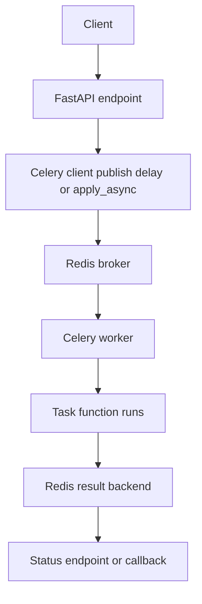
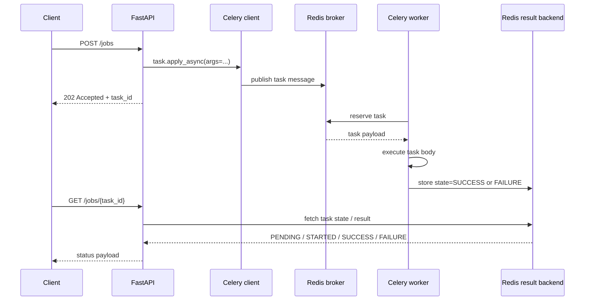
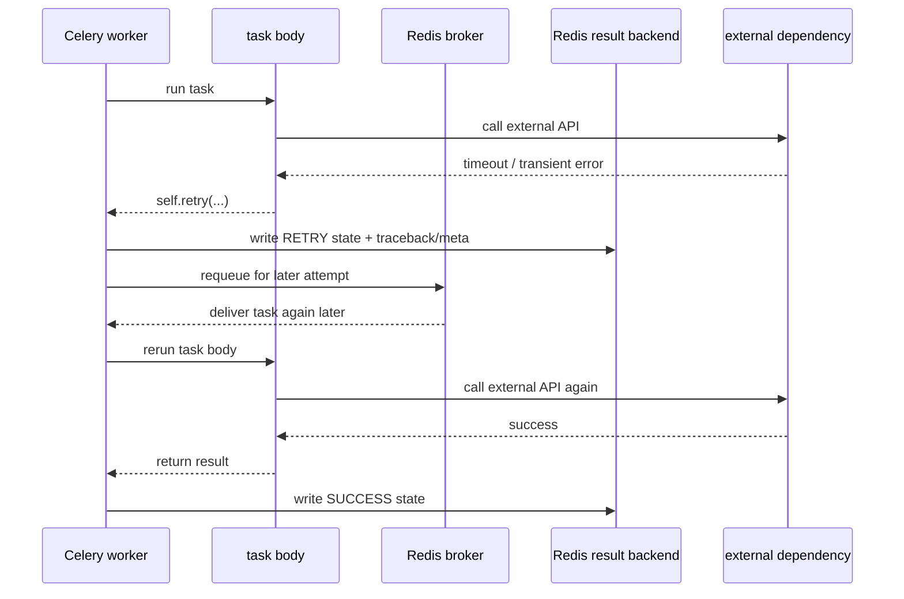
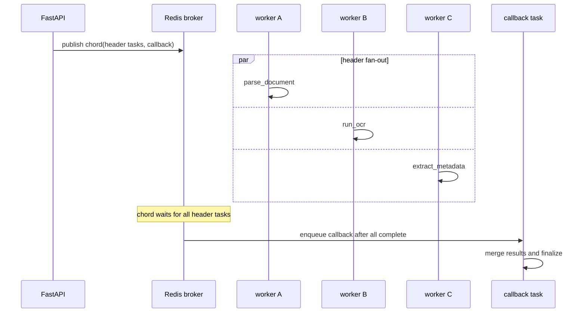
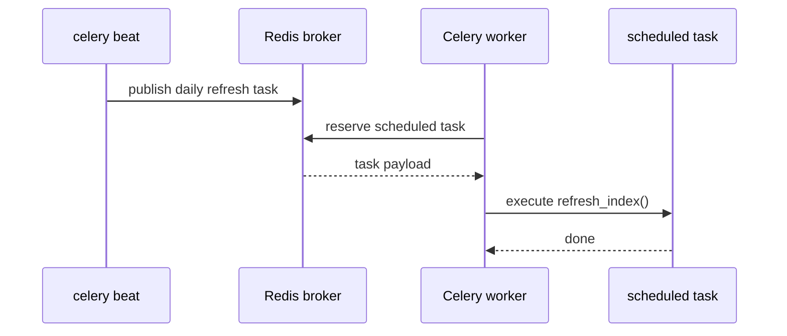
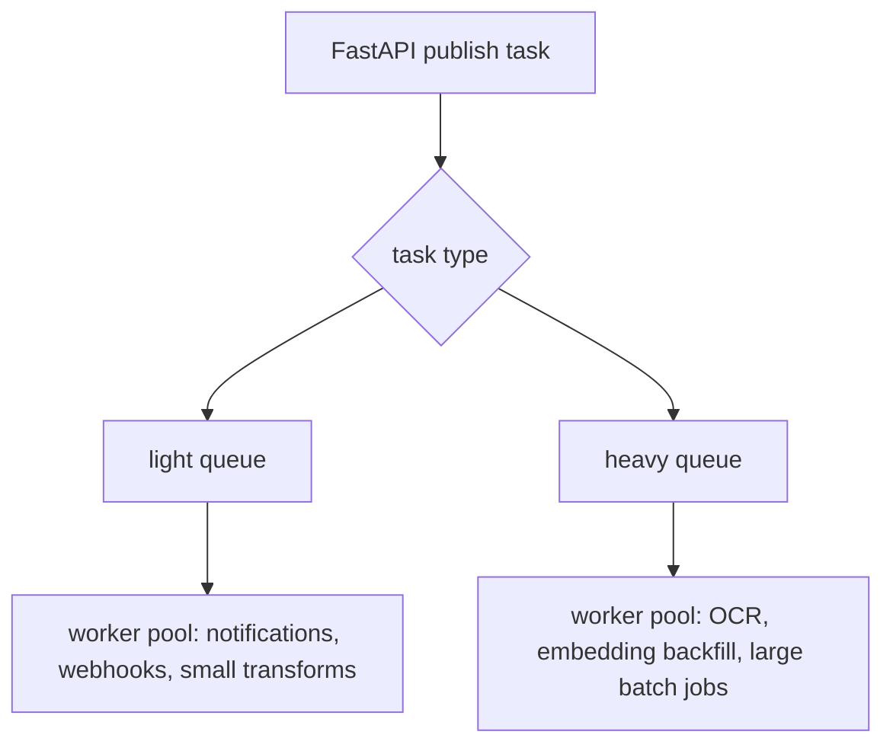

# Celery + Redis Sequence Diagrams

Date: 2026-04-12

Goal: build an intuition for how a FastAPI app hands work off to Celery, how Redis participates as broker and result backend, and where retries, scheduling, and fan-in actually happen.


```text
Host machine
 └ Docker Compose or local processes
    ├ api container / process
    │  └ FastAPI app
    │     └ request handler publishes Celery task messages
    ├ redis container / process
    │  ├ broker data structures for queued task messages
    │  └ result backend data for task state / result metadata
    ├ celery worker container / process
    │  ├ worker process
    │  ├ pool slot 1 executes task
    │  ├ pool slot 2 executes task
    │  └ acks / retries / result writes
    └ optional celery beat container / process
       └ periodic scheduler publishes tasks on a schedule
```

Important hierarchy:

- The FastAPI process and the Celery worker process are separate systems.
- The request thread or event loop does not execute the background task body.
- Celery clients publish task messages to the broker; workers consume and execute them later.
- With Redis, one service can act as both broker and result backend, but those are two different responsibilities.
- `celery beat` is a scheduler, not a worker.
- A task may run more than once in failure scenarios, so duplicate-safe task design matters.


## 0. Mental model: request/response path versus background execution path

Key idea:

- The API path should usually accept work quickly.
- Celery handles long-running or failure-prone work outside the request lifecycle.
- The user often gets `202 Accepted` plus a task id, then polls or waits for a later callback.




## 1. Submit task now, execute later, poll status later

Key idea:

- The web app publishes a task message and returns quickly.
- The worker picks up the job asynchronously.
- Status is read from the result backend, not from the original request handler’s stack frame.




## 2. Retry on transient failure

Key idea:

- Retries are for transient problems such as network timeouts or rate limits.
- A retry is a new delivery attempt, not a magical continuation of the same Python stack.
- If the task can partially succeed before failing, idempotency becomes mandatory.




## 3. `chain`, `group`, and `chord`

Key idea:

- `chain` is a pipeline.
- `group` is fan-out.
- `chord` is fan-out followed by a callback after all children finish.

This is the part of Celery that feels closest to real document, media, and evaluation pipelines.




## 4. Beat publishes scheduled tasks

Key idea:

- `celery beat` does not run the task body.
- Beat only decides when to publish the task.
- A normal worker still has to consume and execute the scheduled message.




## 5. Routing and queue separation

Key idea:

- Not every task should compete in one queue.
- Light, latency-sensitive tasks and heavy, slow tasks usually need different queues or workers.




## 6. What usually goes wrong in first Celery systems

- Returning from the API only after calling `.get()` on the task result, which defeats the point of background work.
- Treating retries as harmless without making the task duplicate-safe.
- Sending every task to one default queue until long jobs starve short jobs.
- Confusing broker state with business-state persistence.
- Forgetting that result backends can grow without retention policy.
- Assuming one Redis-backed task queue is enough for every workflow in a larger system.


## 7. Minimal task shapes worth learning

You do not need twenty patterns at the start. Learn these first:

1. fire-and-poll: submit a task and poll status
2. retryable task: explicit retry for transient failures
3. fan-out / fan-in: `group` or `chord`
4. scheduled task: beat plus workers
5. routed task: separate queues for heavy versus light work


## References

- Celery first steps: https://docs.celeryq.dev/en/stable/getting-started/first-steps-with-celery.html
- Celery tasks: https://docs.celeryq.dev/en/stable/userguide/tasks.html
- Celery calling tasks: https://docs.celeryq.dev/en/stable/userguide/calling.html
- Celery canvas: https://docs.celeryq.dev/en/stable/userguide/canvas.html
- Celery periodic tasks: https://docs.celeryq.dev/en/stable/userguide/periodic-tasks.html
- Celery routing tasks: https://docs.celeryq.dev/en/stable/userguide/routing.html
- Celery workers guide: https://docs.celeryq.dev/en/stable/userguide/workers.html
- Redis lists: https://redis.io/docs/latest/develop/data-types/lists/
- Redis streams: https://redis.io/docs/latest/develop/data-types/streams/
