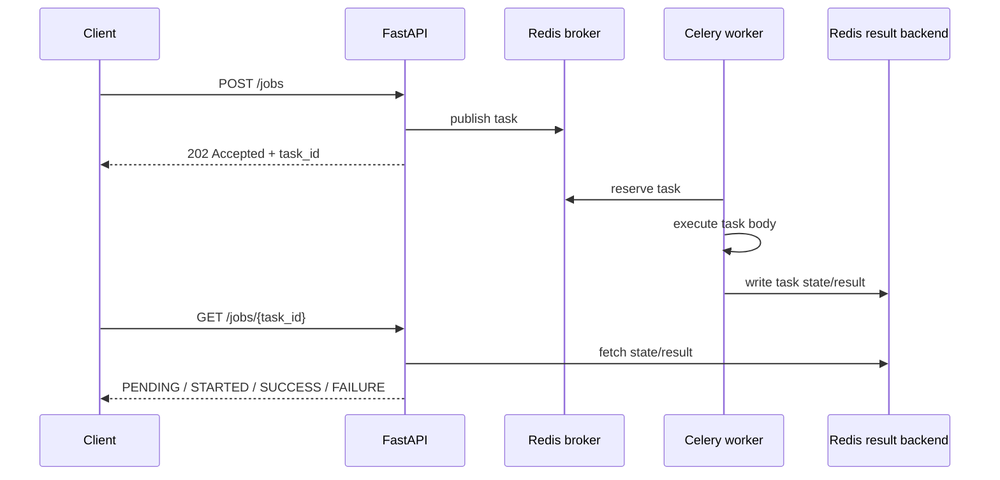
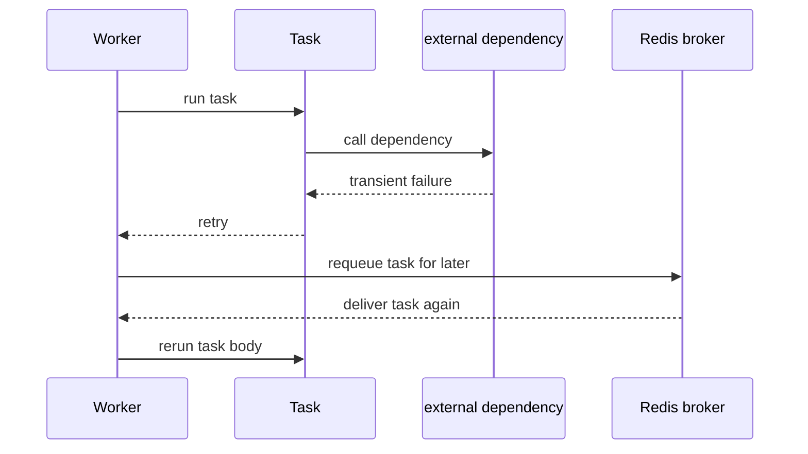
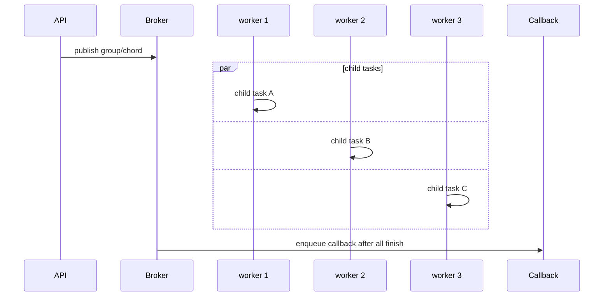

# Celery + Redis Overview

Date: 2026-04-12

Goal: build the right runtime mental model before implementing anything.

This tutorial track is organized like this:

- `00` is the overview.
- `01` through `08` are the actual exercises and interview-style prompts.
- The API file for this track is intentionally left unimplemented so you can fill it in yourself later from the docs.


## Runtime model

```text
Client
 └ HTTP request
    └ FastAPI app
       └ publishes Celery task message
          └ Redis broker
             └ Celery worker process
                └ task execution
                   └ Redis result backend
                      └ later poll / callback / downstream update
```

Important hierarchy:

- The API process and the worker process are different execution systems.
- Redis as broker is not the same concern as Redis as result backend.
- `celery beat` publishes scheduled tasks. Workers execute them.
- Retries mean the task body may run more than once.
- Idempotency matters as soon as retries or redelivery exist.


## Sequence diagrams

### Submit now, execute later, poll later



### Retry on transient failure



### Fan-out / fan-in




## Where this shows up in frontier labs and companies

- Document ingestion: parse, OCR, metadata extraction, chunking, embedding, indexing.
- Benchmark and eval runs: schedule long-running evaluations, poll progress later.
- Batch media or report generation: accept work quickly, finish it out of band.
- Mixed-workload platforms: route user-facing short jobs away from heavy backfills.
- Periodic maintenance: stale index refresh, expired job cleanup, scheduled checks.

If you understand the toy exercises in this track, you will recognize the same failure modes in larger AI and product systems:

- request handlers waiting too long
- retries without duplicate-safe side effects
- one noisy queue starving everything else
- no clear distinction between scheduler, broker, worker, and result store


## Suggested route scaffold

The matching study scaffold lives in [app/api/tutorials_celery_redis.py](/Users/yao/projects/fastapi-load-testing/app/api/tutorials_celery_redis.py#L1).

Suggested route order:

1. `POST /tutorials/celery-redis/jobs/submit`
2. `GET /tutorials/celery-redis/jobs/{task_id}`
3. `POST /tutorials/celery-redis/jobs/retry-demo`
4. `POST /tutorials/celery-redis/jobs/progress-demo`
5. `POST /tutorials/celery-redis/jobs/fanout`
6. `POST /tutorials/celery-redis/beat/tick`
7. `GET /tutorials/celery-redis/queues/stats`
8. `POST /tutorials/celery-redis/streams/compare`


## Official references

- Celery first steps: https://docs.celeryq.dev/en/stable/getting-started/first-steps-with-celery.html
- Celery tasks: https://docs.celeryq.dev/en/stable/userguide/tasks.html
- Celery calling API: https://docs.celeryq.dev/en/stable/userguide/calling.html
- Celery canvas: https://docs.celeryq.dev/en/stable/userguide/canvas.html
- Celery periodic tasks: https://docs.celeryq.dev/en/stable/userguide/periodic-tasks.html
- Celery routing: https://docs.celeryq.dev/en/stable/userguide/routing.html
- Celery monitoring: https://docs.celeryq.dev/en/stable/userguide/monitoring.html
- Redis lists: https://redis.io/docs/latest/develop/data-types/lists/
- Redis streams: https://redis.io/docs/latest/develop/data-types/streams/
