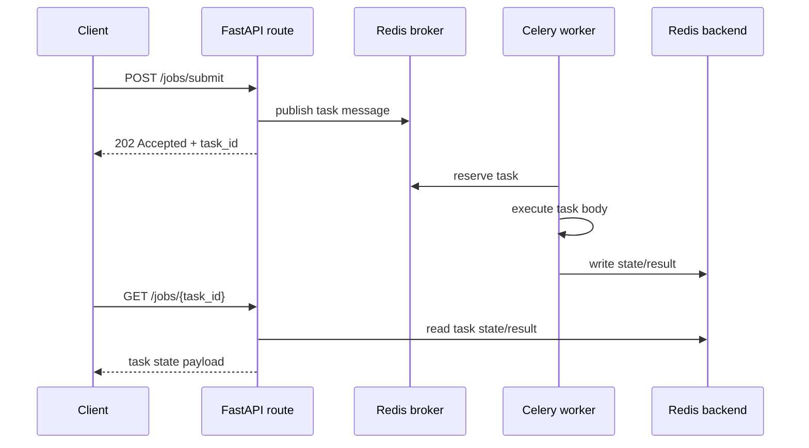

# 01: Submit And Poll

Date: 2026-04-12

Prompt:

Implement the smallest useful Celery-backed API pair:

- `POST /tutorials/celery-redis/jobs/submit`
- `GET /tutorials/celery-redis/jobs/{task_id}`

What the interviewer or exercise is testing:

- whether you keep the HTTP request short
- whether you return `202 Accepted` and a stable task identifier
- whether you understand that status is read from the result backend later

Minimum success criteria:

- submit returns quickly
- poll exposes `PENDING`, `STARTED`, `SUCCESS`, `FAILURE`
- route contract is clear even before the task body becomes complex

## Sequence diagram

## Implementation hints

- Start with one integer input like `duration_ms` so the route contract stays obvious.
- Return `202 Accepted` with `task_id`, `status`, and a poll URL or route hint.
- Keep the poll route read-only. It should only inspect backend state.
- Decide early whether a missing task id returns backend-style `PENDING`, synthetic `UNKNOWN`, or HTTP `404`.
- Do not call `.get()` or wait for completion in the request handler.

Follow-up questions:

- When should you store job state in your own database instead of only the result backend?
- What should the response shape be if the task does not exist?
