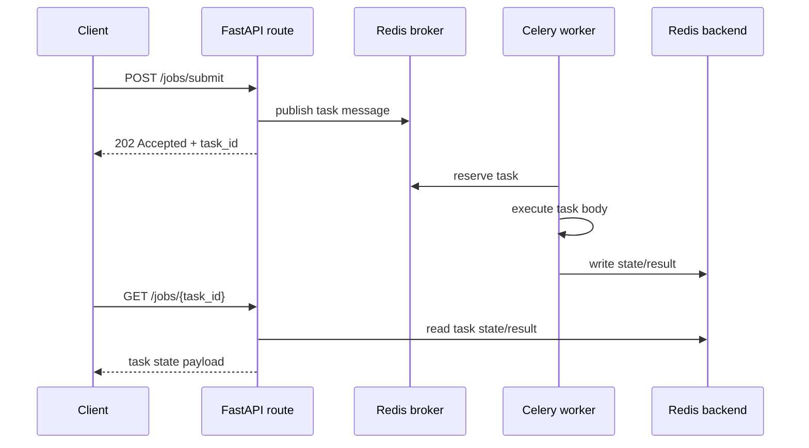

# 01: Submit And Poll

Date: 2026-04-12

Prompt:

Implement the smallest useful Celery-backed API pair:

- `POST /tutorials/celery-redis/jobs/submit`
- `GET /tutorials/celery-redis/jobs/{task_id}`

What the interviewer or exercise is testing:

- whether you keep the HTTP request short
- whether you return `202 Accepted` and a stable task identifier
- whether you understand that status is read from the result backend later

Minimum success criteria:

- submit returns quickly
- poll exposes `PENDING`, `STARTED`, `SUCCESS`, `FAILURE`
- route contract is clear even before the task body becomes complex

## Sequence diagram



## Implementation hints

- Start with one integer input like `duration_ms` so the route contract stays obvious.
- Return `202 Accepted` with `task_id`, `status`, and a poll URL or route hint.
- Keep the poll route read-only. It should only inspect backend state.
- Decide early whether a missing task id returns backend-style `PENDING`, synthetic `UNKNOWN`, or HTTP `404`.
- Do not call `.get()` or wait for completion in the request handler.

Follow-up questions:

- When should you store job state in your own database instead of only the result backend?
- What should the response shape be if the task does not exist?

## Verified In This Repo

Current implementation:

- `POST /tutorials/celery-redis/jobs/submit?duration_ms=2000`
- `GET /tutorials/celery-redis/jobs/{task_id}`

Verified example:

```bash
curl -X POST "http://localhost:8000/tutorials/celery-redis/jobs/submit?duration_ms=2000"
```

Example response:

```json
{
  "task_id": "c268f507-96c5-4f80-938e-2c5c58256212",
  "status": "PENDING",
  "poll_url": "http://localhost:8000/tutorials/celery-redis/jobs/c268f507-96c5-4f80-938e-2c5c58256212"
}
```

Then poll the returned URL:

```bash
curl "http://localhost:8000/tutorials/celery-redis/jobs/c268f507-96c5-4f80-938e-2c5c58256212"
```

Example terminal-state response:

```json
{
  "task_id": "c268f507-96c5-4f80-938e-2c5c58256212",
  "state": "SUCCESS",
  "ready": true,
  "result": "done"
}
```

Notes:

- This confirms the basic submit-and-poll contract for tutorial `01`.
- This does not complete tutorial `02`; that exercise is about retries and idempotency, not polling.
- The current implementation shows `PENDING` and `SUCCESS` cleanly.
- If you want this tutorial to also demonstrate `STARTED`, enable Celery started-state tracking in the Celery app config.
- The submit route currently accepts `duration_ms` as a query parameter. That is acceptable for the tutorial, though a small JSON body would be closer to a production-style submit API.
