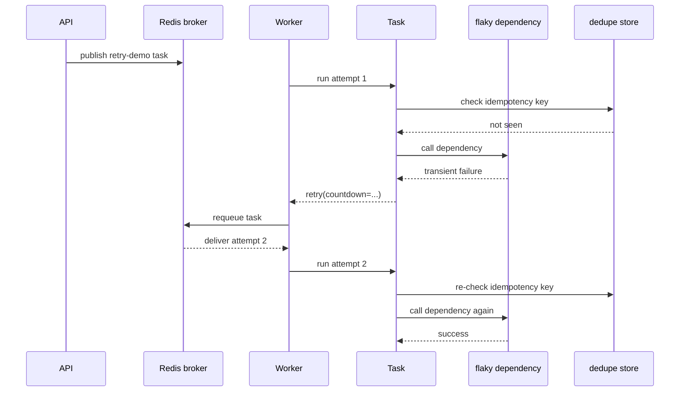

# 02: Retries And Idempotency

Date: 2026-04-12

Prompt:

Design a task that talks to a flaky dependency and may need retry.

What the interviewer or exercise is testing:

- whether you know retries are for transient failures
- whether you understand duplicate-safe side effects
- whether you can explain why task id is not enough as a business dedupe key

Minimum success criteria:

- task retries on transient failure
- side effects are protected by an idempotency key or dedupe record
- logs or state make attempt count visible

## Sequence diagram

## Implementation hints

- Make the failure deterministic for the exercise, such as “fail on first attempt, succeed on second”.
- Put retry logic in the task body, not in the FastAPI route.
- Protect the side effect with a business idempotency key, not only the Celery task id.
- Record attempt count in logs or task metadata so the learner can see retry behavior.
- Discuss what happens if the side effect succeeds but the task crashes before the final state write.

Follow-up questions:

- What happens if the task partially succeeds before raising?
- How do you prevent duplicate emails, duplicate indexing, or duplicate writes?
