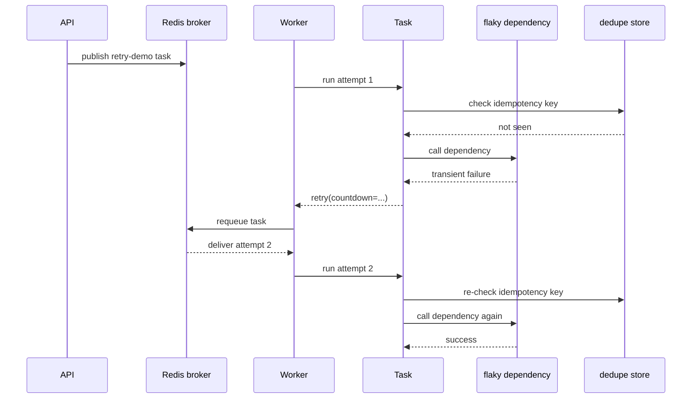

# 03: Retries And Idempotency

Date: 2026-04-14

Prompt:

Design a task that talks to a flaky dependency and may need retry.

Simplified learning goal:

Learn one idea at a time:

1. a retry means the same task body may run again
2. a side effect may already have happened before the retry
3. idempotency means the side effect is still applied at most once

What this exercise is testing:

- whether you know retries are for transient failures
- whether you understand that task re-execution is normal, not exceptional
- whether you can protect duplicate-sensitive side effects
- whether you can explain why Celery task id is not enough as a business dedupe key

Minimum success criteria:

- task retries on transient failure
- side effects are protected by a business idempotency key or dedupe record
- logs or state make attempt count visible

## Before you start

If any of these are still unclear, go back to `01` and `02` first:

- who publishes the task
- who runs the task
- where task state is stored
- why the HTTP request is already over before retry happens

## Sub-learning goals

### A. Understand retry without idempotency

First learn the unsafe version:

- attempt 1 runs
- dependency fails
- Celery retries
- attempt 2 runs the task body again

This is the point where duplicate side effects become possible.

### B. Understand what counts as a side effect

A side effect is anything you do not want duplicated:

- send an email
- charge a card
- write a DB row
- enqueue another external job

Logging or computing a local variable is not the important part. The important part is the duplicate-sensitive action.

### C. Understand idempotency in one sentence

If the same business request is retried, the side effect should happen at most once.

### D. Learn the minimal safe pattern

Use a business key like `email_id` or `order_id`, then:

1. check dedupe store
2. if already completed, skip side effect
3. otherwise perform side effect
4. record that the side effect is done
5. return success

## Sequence diagram

## Concrete task list

Do these in order instead of jumping straight to the final version:

1. Make a retry demo that fails on the first attempt and succeeds on the second.
2. Print or return the attempt number so you can see the retry happen.
3. Add one fake business input such as `business_id`.
4. Add one fake side effect, such as writing `business_id` into Redis or appending to a Redis list.
5. Fail after the side effect on attempt 1.
6. Add a dedupe record keyed by `business_id`.
7. On retry, skip the side effect if the dedupe record says it already happened.
8. Return a response that says whether the result was `fresh` or `deduped`.

## Implementation hints

- Make the failure deterministic for the exercise, such as “fail on first attempt, succeed on second”.
- Put retry logic in the task body, not in the FastAPI route.
- Protect the side effect with a business idempotency key, not only the Celery task id.
- Keep the first dedupe store simple. Redis is fine for the tutorial.
- Record attempt count in logs or task metadata so the learner can see retry behavior.
- Explicitly model the hard case: the side effect succeeds, then the task crashes before writing final success state.

## Minimal safe shape

Use Redis with a key like `retry-demo:{business_id}` and store fields like:

- `status`
- `attempt`
- `side_effect_done`
- `result`

The teaching point is not Redis itself. Redis is only standing in for "some durable place where you can check whether this business action already happened."

## Questions to answer after implementation

- What happens if the task partially succeeds before raising?
- What breaks if you dedupe by Celery `task_id` instead of `business_id`?
- What should happen if the side effect succeeded but the final state write failed?
- How would the design change if the downstream service already supports idempotency keys?
