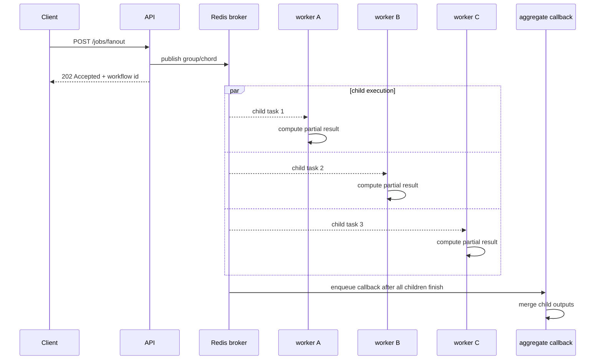

# 04: Fan-Out And Fan-In

Date: 2026-04-12

Prompt:

Model a workflow where one user request causes several child tasks to run in parallel, then combines their results.

What the interviewer or exercise is testing:

- whether you know the difference between one task and one workflow
- whether you can explain `group`, `chain`, and `chord` at a practical level

Minimum success criteria:

- child tasks can run independently
- parent or callback logic waits for all required children
- result aggregation logic is explicit

## Sequence diagram

## Implementation hints

- Start with small independent child tasks that return deterministic values.
- Decide whether you want a `group`, `chain`, or `chord` before writing the route.
- Return both the parent workflow id and the child task ids if that helps debugging.
- Define failure policy up front: fail fast, partial results, or compensating action.
- Do not use fan-out for tiny work items unless the queueing overhead is worth it.

Follow-up questions:

- What should happen if one child fails?
- When should you prefer one larger task instead of many small tasks?
