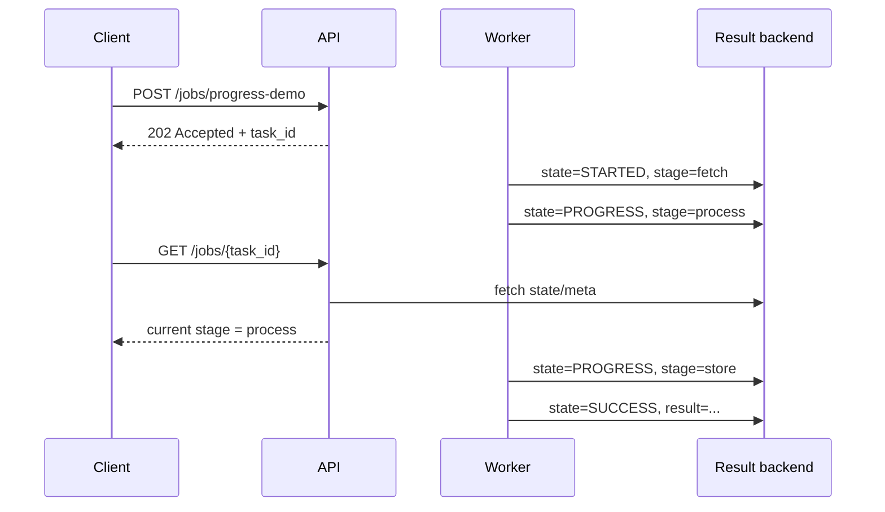

# 04: Progress Reporting

Date: 2026-04-12

Prompt:

Design a long-running task with visible stages such as:

- fetch
- process
- store

What the interviewer or exercise is testing:

- whether you understand that users and operators care about stage, not just final status
- whether you can expose useful progress metadata without inventing a huge workflow engine

Minimum success criteria:

- task state changes during execution
- poll endpoint can report current stage
- failure output preserves the stage where the task died

## Sequence diagram

## Implementation hints

- Prefer discrete stage names like `fetch`, `process`, and `store` over fake percentages.
- Include stage timestamps or attempt counts if they help with debugging.
- Make the poll output useful to operators, not just end users.
- Preserve the last stage in failure responses so the system tells you where it stopped.
- Keep the first metadata schema small; expanding later is easier than shrinking it.

Follow-up questions:

- When is percentage progress misleading?
- What metadata is actually useful for debugging?
