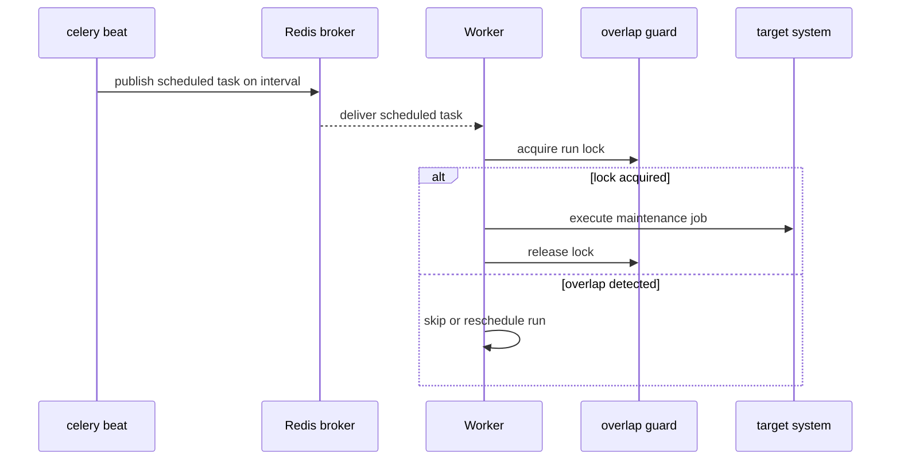

# 06: Periodic Jobs And Beat

Date: 2026-04-12

Prompt:

Design a scheduled task flow using `celery beat`.

What the interviewer or exercise is testing:

- whether you know beat is a scheduler, not a worker
- whether you can describe recurring maintenance or refresh work cleanly

Minimum success criteria:

- scheduled publish path is clear
- worker execution path is separate
- overlap policy is discussed

## Sequence diagram

## Implementation hints

- Keep the roles separate in your explanation: beat schedules, workers execute.
- Use a concrete example like stale-cache refresh or expired-job cleanup.
- Discuss overlap policy explicitly: lock, skip, or serialize runs.
- Explain what happens when beat is healthy but workers are unavailable.
- If you expose a tutorial route, make it educational rather than production-critical.

Follow-up questions:

- What happens if beat is running but workers are down?
- How do you prevent overlapping scheduled runs?
