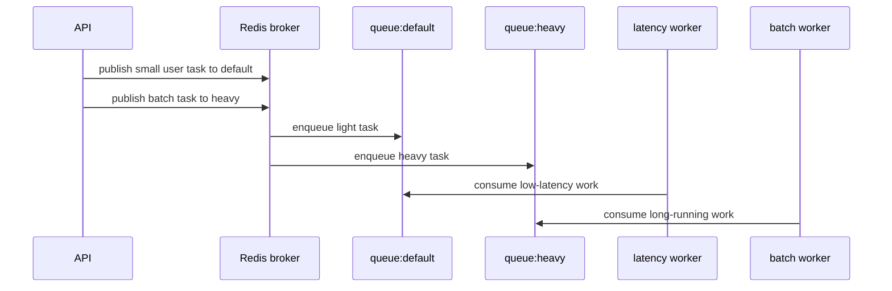

# 06: Queue Routing And Isolation

Date: 2026-04-12

Prompt:

Explain how you would separate light jobs from heavy jobs.

What the interviewer or exercise is testing:

- whether you understand queue starvation
- whether you can reason about worker ownership and workload isolation

Minimum success criteria:

- define at least two queues
- describe which tasks belong in each queue
- describe which workers consume which queues

## Sequence diagram

## Implementation hints

- Name queues by workload shape, not by vague labels like `queue1` and `queue2`.
- Route latency-sensitive jobs away from heavy backfills.
- Make worker ownership explicit: which workers listen to which queues, and why.
- Expose queue depth and completion latency when proving that isolation helped.
- Keep the first routing setup small; two queues is enough to teach the idea.

Follow-up questions:

- What breaks if everything stays on the default queue?
- How do you prove that heavy backlog is no longer hurting light jobs?
