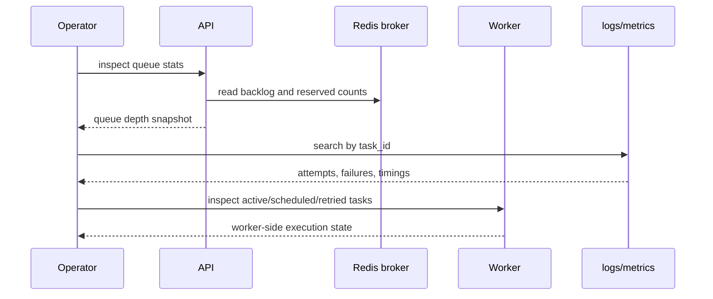

# 07: Observability And Failure Diagnosis

Date: 2026-04-12

Prompt:

Explain how you would debug a stuck or slow Celery system.

What the interviewer or exercise is testing:

- whether you think operationally about queues, active tasks, retries, and backlog
- whether you can distinguish broker issues from worker issues from dependency issues

Minimum success criteria:

- mention queue depth
- mention active versus scheduled versus failed tasks
- mention correlation of task id across logs and monitoring

## Sequence diagram

## Implementation hints

- Organize debugging by layer: broker, worker, dependency, then application code.
- Track one correlation id or task id across route logs, worker logs, and metrics.
- Separate waiting work from executing work; they indicate different bottlenecks.
- A growing queue with idle workers usually points to routing, worker health, or broker issues.
- Slow completions with stable queue depth usually point to task body or dependency latency.

Follow-up questions:

- What does a growing queue with idle workers suggest?
- What does a stable queue with slow completions suggest?
