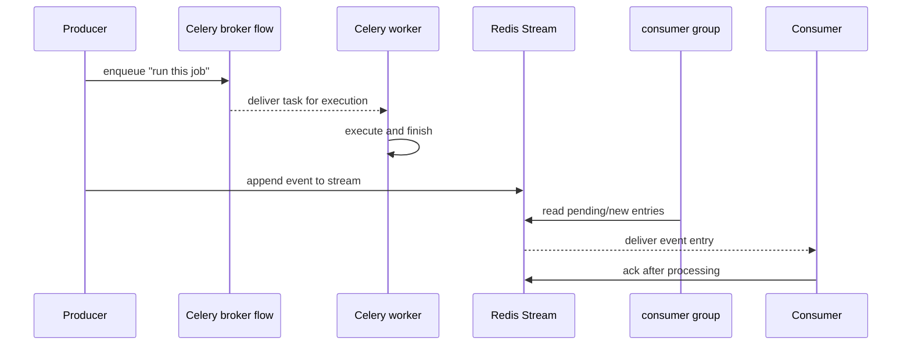

# 09: Celery Vs Redis Streams

Date: 2026-04-12

Prompt:

Compare Celery task queues with Redis Streams consumer groups.

What the interviewer or exercise is testing:

- whether you choose tools by workload shape instead of habit
- whether you can distinguish task execution from event-log processing

Minimum success criteria:

- explain when Celery is the better fit
- explain when Streams are the better fit
- discuss acknowledgements, replay, and pending work at a practical level

## Sequence diagram

## Implementation hints

- Frame the choice by workload shape: command/task execution versus event-log processing.
- Celery is usually simpler for “run this function later and give me task state”.
- Streams are usually stronger when you need replay, pending-entry inspection, or ordered event consumption.
- It is valid to use both in one system: Celery for background jobs, Streams for durable event pipelines.
- Avoid claiming one tool is categorically better; explain the operational tradeoff instead.

Follow-up questions:

- Why might one platform use both?
- Which one is easier to reason about for “run this job later” versus “process this event log”?
